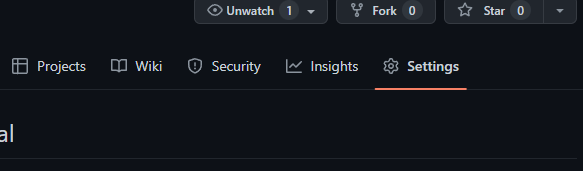
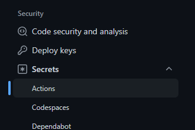
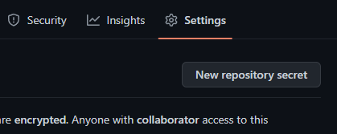
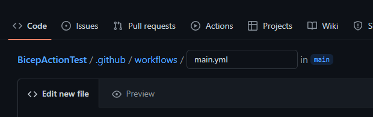
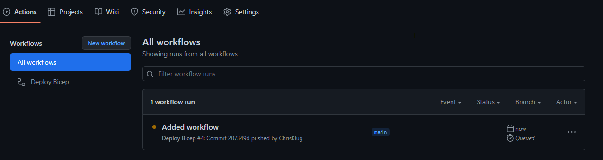
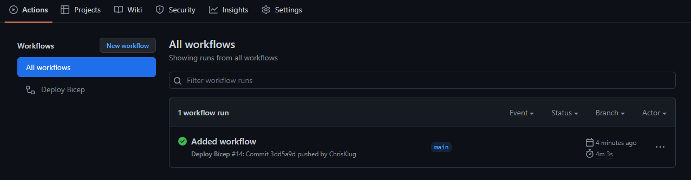
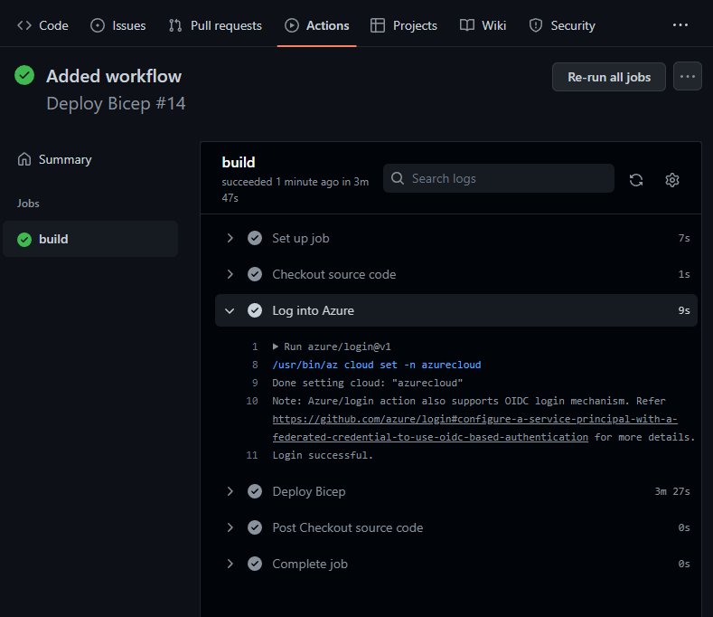

# Infrastructure as Code Labs - CI/CD using Bicep and GitHub Actions
Welcome to the GitHub Actions lab for the Infrastructure as Code workshop. In this lab, you will setup a GitHub Action that continuously deploys the infrastructure you defined in your Bicep templates to Azure.

## Prerequisites
To complete the lab you need to have completed the Bicep lab, and have the created templates in a separate directory, as well as a GitHub account. 

__Note:__ You will also need to have the Azure CLI installed, and logged in, but this should already be in place from the lab.

## Creating the GitHub repo
The first thing we need to do, is to get the code into GitHub. So, start off by going to GitHub and create a new repo. 

You can name it whatever you want, and make it private.

__Comment:__ Do not add a README, .gitignore file or license. Leave the repo completely empty.

Once this is done, you will be faced with a screen that explains how you can add a new repo. You can follow those steps more or less completely. However, the `README.md` file is not needed, so you can skip that step. And you want to add _everything_ in your directory. So use `git add -A` instead of the suggested `git add README.md`. Like this

```bash
> git init
> git add -A
> git commit -m "Initial commit"
> git remote add origin https://github.com/<GITHUB USERNAME>/<REPO NAME>.git
> git push -u origin main
```

__Note:__ Remember to execute these commands in the directory that contains your finished Bicep lab code.

Once this is done, you should be able to view your code on GitHub by browsing to `https://github.com/<GITHUB USERNAME>/<REPO NAME>`.

## Creating a Service Principal
When the GitHub action talks to Azure to create your infrastructure, it needs to use some form of credentials. These credentials are created by creating a `Service Principal`. This is like a system user that can be given access to perform actions in the Azure subscription. 

In this case, you want to limit the principal so that it can only make changes in a single resource group. So you first need to create the resource group that you want to deploy to by running

```bash
> az group create -n GitHubBicepGroup -l westeurope
```

Then, you need to create a new Service Principal, by running the following command

```bash
> az ad sp create-for-rbac --name GitHubAction --role contributor --scopes /subscriptions/<SUBSCRIPTION ID>/resourceGroups/GitHubBicepGroup --sdk-auth

{
  "clientId": "XXXXXXXX-XXXX-XXXX-XXXX-XXXXXXXXXXXX",
  "clientSecret": "XXXXXXXXXXX",
  "subscriptionId": "XXXXXXXX-XXXX-XXXX-XXXX-XXXXXXXXXXXX",
  "tenantId": "XXXXXXXX-XXXX-XXXX-XXXX-XXXXXXXXXXXX",
  "activeDirectoryEndpointUrl": "https://login.microsoftonline.com",
  "resourceManagerEndpointUrl": "https://management.azure.com/",
  "activeDirectoryGraphResourceId": "https://graph.windows.net/",
  "sqlManagementEndpointUrl": "https://management.core.windows.net:8443/",
  "galleryEndpointUrl": "https://gallery.azure.com/",
  "managementEndpointUrl": "https://management.core.windows.net/"
}
```

This will output a JSON-blob with all the information needed to talk to Azure as that principal. Make sure to copy the JSON somewhere as you will need it in just a minute!

__Suggestion:__ If you want to get hold of your subscription ID, try running `az account show --query id --out tsv`. This will give you the subscription ID for the currently logged in user.

__Note:__ The principal will be given full `contributor` access, but only to that single resource group.

## Adding Service Principal credentials to GitHub
Now that you have created the Service Principal, and you have the credentials, these need to be stored in GitHub so that the Action can access them.

For this, GitHub offers the idea of "secrets". These are configuration values stored in GitHub, and made available to the Action when it runs.

So head over to your repo on GitHub, and click on the __Settings__ tab.



And then __Secrets > Actions__



And then __New repository secret__.



Name the secret `AZURE_CREDENTIALS` and set the value to be the whole JSON-blob that was output from the `az ad sp create-for-rbac` call.

You will also need the Subscription ID during the deployment. So go ahead and create a secret called `AZURE_SUBSCRIPTION_ID` and set the value to the Subscription ID you want to use.

## Create a GitHub workflow
Now that the access has been set up, and credentials have been added to GitHub, it is time to set up the workflow that will run the Bicep reployment.

__Note:__ A workflow is a series of GitHub Actions that are set up together to solve a problem.

The easiest way to do this, is to click on the __Actions__ tab in your repo


and then select a pre-defined workflow that fits your needs somewhat well. 

The second easiest way to do it, which is what you should do, is to click on the "_set up a workflow yourself_" link. This will give you a template workflow to start from. 

There are 2 ways to work with this workflow. One is to do it on GitHub, in the web browser. The other is to just addit to the repo, and then edit it using your editor of choice. 

For this lab, we suggest that you use the GitHub website, as the documentation and Actions marketplace is readily available to you on the right.

Let's start by cleaning up the sample workflow and remove some of the code and comments, to make it easier to read.

You can clean out all the comments, the `pull_request` entry, and the two script steps. This will make the workflow a little easier to read.

Like this

```yaml
name: Deploy Bicep

on:
  push:
    branches: [ main ]

  workflow_dispatch:

jobs:
  build:
    runs-on: ubuntu-latest

    steps:
      - uses: actions/checkout@v3
```

__Note:__ You can name the workflow whatever you want

The `on` entry defines when the workflow should run. In this case, it should run on and push to the _main_ branch in the repo. As well as on `workflow_dispatch`. This means that you should be able to run it manually through the UI, which can be really helpful.

A workflow then consists of one or more `jobs`, which are sets of actions that should be performed. In this case, there is a single job called __build__, that should run on a michine with the latest version of Ubuntu.

A job then defines steps that should be performed. In this case, there is a single `actions/checkout@v3` step that should be performed. 

__Note:__ All actions are GitHub repos that you can look at. In the case of `actions/checkout@v3`, it is available at https://github.com/actions/checkout/tree/v3.0.0.

Ok, so that is a good start! But you need to do more than just checkout the code. 

### Logging into Azure
The first step you need to do before you can deploy your Bicep, is to log into Azure. Luckily, there is a pre-build Action for that specific task. It is called `azure/login@v1`.

So to add that, you just have to add another `uses` entry

```yaml
    steps:
      - uses: actions/checkout@v3

      - uses: azure/login@v1
```

__Note:__ Remember that YAML is whitespace sensitive. So make sure you get you indentation correct!

Any step, or `uses` entry can have parameters. These are passed in using a sibling entry called `with`, defining the parameters as child entries. In this case, the `azure/login@v1` Action has a parameter called `creds`, that should contain the credentials to use when loggin in. Luckily, the format to be used when setting the credentials, happens to be the same that we got from the `az ad sp create-for-rbac` call and added to the `AZURE_CREDENTIALS` secret.

So to log in using the Service Principal we created, you just need to write

```yaml
    steps:
      - uses: actions/checkout@v3

      - uses: azure/login@v1
        with:
          creds: ${{ secrets.AZURE_CREDENTIALS }}  
```

The `${{ secrets.AZURE_CREDENTIALS }}` will be replaced by the value of the `AZURE_CREDENTIALS` secret when the workflow runs.

__Comment:__ If you want to know more about an Action, just browse for it in the marketplace tab on the right. Unfortunately, in the case of the `azure/login` Action, the "Installation" information is a bit lacking. However, if you click in the _View full Marketplace listing_ link, you will get a ton of information about it.

### Deploying the Bicep
Now that you have logged into Azure, the next step is to deploy the Bicep. And once again, there is a pre-defined Action available for this. It is called `azure/arm-deploy@v1`, and takes the following parameters

- __subscriptionId__ - The ID of the Subscription to deploy to
- __resourceGroupName__ - The name of the resource group to deploy to
- __template__ - The path to the AMR or Bicep template to deploy
- __parameters__ - The parameters to pass to the ARM or Bicep template
- __failOnStdErr__ - Whether or not to fail the workflow on a "standard out"

In this case, it should look like this

```yaml
    steps:
      - uses: actions/checkout@v3

      - uses: azure/login@v1
        with:
          creds: ${{ secrets.AZURE_CREDENTIALS }} 

      - uses: azure/arm-deploy@v1
        with:
          subscriptionId: ${{ secrets.AZURE_SUBSCRIPTION_ID }}
          resourceGroupName: GitHubBicepGroup
          template: ./template.bicep
          parameters: ./template.parameters.json location=westeurope
          failOnStdErr: false
```

As you can see, populating the Action is quite simple. In this case, the population is done by either hard-coding the value, like with __resourceGroupName__, or by using secrets, like with __subscriptionId__.

The __parameters__ parameter is a little bit special. It takes one or more parameters, separated by a space. The parameter can either be the path to a parameters file, or individually set parameters. In this case, you are using a combination of the two.

### Add the workflow to the repo
The last step is to save the workflow. At the top of the screen, you have an input field where you can name the file. By default, it is called __main.yaml__.



You can change the name if you want, or just leave it as __main.yml__. The lab will assume you left it as __main.yml__.

When you click __Start commit__ you will be asked for a commit message and an optional description. Go ahead and add whatever commit message you want, and click __Commit new file__.

This will add your workflow file to your repo in a folder called `.github/workflows`. If you update your local repo, you will see the file having been added

```bash
> git pull
```

## Viewing the workflow status
As soon as you commit the workflow to the main branch, it will get run. To see the outcome of this run, you can click on the __Actions__ tab again. 

This will show you the current status of all your workflows. In this case, you might see either something like this



as the workflow is waiting to be run, or



And if you click on the workflow run, and then the __build__ job box, you get the log from the run, telling you exactly what was done.



If you don't like the very generic names of each of the job, and steps, you can rename them easily by adding a `name` entry as a child to the job entry, and to each step. Like this

```yml
name: Deploy Bicep

on:
  push:
    branches: [ main ]

  workflow_dispatch:

jobs:
  build:
    name: Deploy infrastructure
    runs-on: ubuntu-latest

    steps:
      - name: Checkout source code
        uses: actions/checkout@v3
      
      - name: Log into Azure
        uses: azure/login@v1
        with:
          creds: ${{ secrets.AZURE_CREDENTIALS }}
          
      - name: Deploy Bicep
        uses: azure/arm-deploy@v1
        with:
          subscriptionId: ${{ secrets.AZURE_SUBSCRIPTION }}
          resourceGroupName: GitHubBicepGroup
          template: ./template.bicep
          parameters: ./template.parameters.json location=swedencentral
          failOnStdErr: false
```

And since you left the `workflow_dispatch` entry, you can start the workflow manually by going to __Actions > Deploy Bicep__ and clicking on the __Run workflow__ button and the __Run workflow__.

## Extras

If you have time left over, and want to try out some extra things, here are some suggestions to what you can do:

### Add a "what-if" step

When running your Bicep templates in a pipeline it can be hard to figure out what will happen. Because of this, it can often be a good idea to add a pipeline step that runs `az deployment group what-if`. This operation will evaluate what would happen if the deployment would proceed, e.g. ehich resources that would be added, deleted and/or modified. 

Unfortunately, there is no pre-defined GitHub action to do this, so you will have to use something like the [Azure CLI Action](https://github.com/marketplace/actions/azure-cli-action).

### Add a manual approval step

Being able to view the output from `what-if` is nice, as it allows you to see what happened when you ran the pipeline. However, in reality it would be much better if you were allowed to look at the changes before it was deployed, and also be able to approve or deny the deployment of the Bicep template based on those reported changes.

To do this, one option is to use the [Manual Workflow Approval](https://github.com/marketplace/actions/manual-workflow-approval) action. This allows you to pause the pipeline and wait for a manual approval before proceeding with running the rest of the pipeline. 

## Clean up
When you are done playing around with the workflow, you can remove all the generated resources by running

```bash
> az group delete --name GitHubBicepGroup
> az ad sp delete --id <SERVICE PRINCIPAL CLIENT ID>
```

Where `<SERVICE PRINCIPAL CLIENT ID>` is the Client ID of the Service Principal you created before. It is available in the JSON blob under the property `clientId`.

Don't forget to remove the repo and secrets from your GitHub repo as well, if you don't want to keep it a play around with it a bit more. And by "play around with it", we obviously mean "empirically verify your theories about CI/CD pipelines in GitHub".
