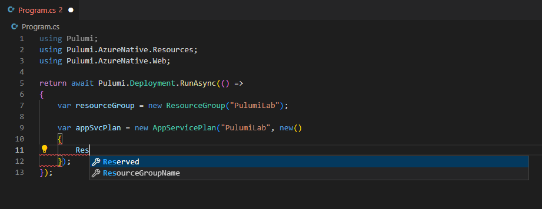
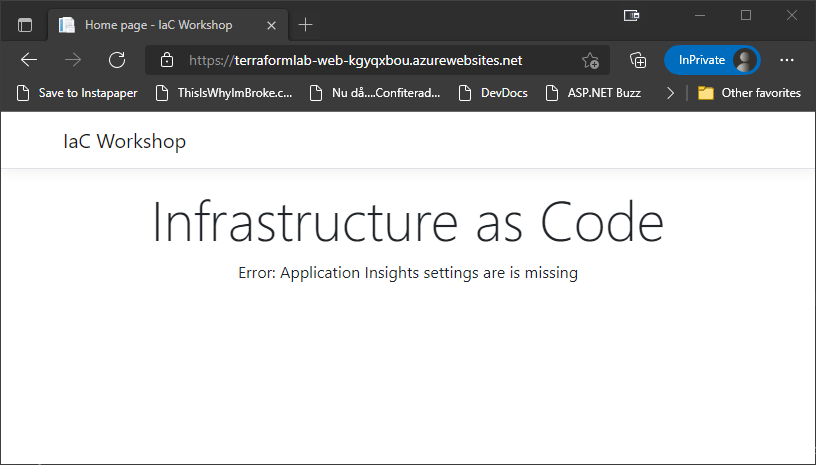

# Infrastructure as Code Labs - Pulumi - C#

Welcome to the Pulumi lab for the Infrastructure as Code workshop. In this lab, you will set up of the following infrastructure resources in Azure using Pulumi, and validate your deployed infrastructure using a pre-built web application along the way:

* Azure App Service running on Linux
* Azure Key Vault for storing sensitive information, such as passwords
* Azure SQL Server and a SQL database
* Application Insights resource backed by a Log Analytics workspace

## Prerequisites

To complete the lab you need to install the Pulumi tooling which include

* Azure CLI
* Visual Studio Code 
* .NET 6 (or above)
* Pulumi

You can find the latest installation instructions for your environment here:

* Azure CLI - https://docs.microsoft.com/en-us/cli/azure/install-azure-cli
* Visual Studio Code - https://code.visualstudio.com/download
* .NET - https://dotnet.microsoft.com/en-us/download
* Pulumi - https://www.pulumi.com/docs/get-started/install/

__Note:__ Pulumi can be installed using Chocolatey, which is a terrific way to do it. To install Chocolatey, have a look at: https://chocolatey.org/install

Once you have the tools installed, you can verify that the CLI parts are working by running:

```bash
> az version
{
  "azure-cli": "2.28.0",
  "azure-cli-core": "2.28.0",
  "azure-cli-telemetry": "1.0.6",
  "extensions": {}
}

> pulumi version
v3.48.0

> dotnet --version
7.0.100
```

With the tools in place, you need to either log in to the Azure CLI, or, if you are already logged in, validate that you are using the correct subscription.

To log in, run the following command, and go through the login procedure

```bash
> az login
```

To validate that you are using the correct subscription, you can run

```bash
> az account show
{
  ...
  "id": "XXXXXXXX-XXXX-XXXX-XXXX-XXXXXXXXXXXX",
  ...
  "name": "My Subscription"
}
```

If this is not the required subscription, you can list the available subscriptions by running

```bash
> az account list
```

and select the subscription you want by running

```bash
> az account set -s <SUBSCRIPTION ID>
```

## Setting up the project

Create a new folder for you Pulumi project and open the folder in Visual Studio Code. 

The first step is to "log in" Pulumi to tell it where to store its state. For this lab, you will store your state in the local folder, which you can tell Pulumi by opening up the terminal and executing

```bash
> pulumi login file://.
```

__Note:__ You can also store the state using the Pulumi online service, Azure Blob Storage, AWS S3 etc. You can also store the state in a sub-folder of your profile (~/.pulumi) using `pulumi login --local`

Once the state storage has been configured, you can start a new Pulumi project using the following command

```bash
> pulumi new azure-csharp
```

This will ask you a few questions that are used to set up the project. Use the following settings

* project name - PulumiLab
* project description - Leave as is by pressing Enter
* stack name - Leave as __dev__ by pressing Enter
* passphrase - this is used to protect the config. Choose a passphrase you will remember
* Azure location - use whatever region is closest to you

__Note:__ To get a list of all the regions you can run `az account list-locations -o table`

This will create a brand new Pulumi project called __PulumiLab__, configured to use C# and .NET, and set up to create resources in Azure.

Once the project creation has completed, you can open the project in VS Code by running

```bash
> code .
```

You should end up with a file explorer, that looks like this


__Note:__ There are several more languages and "targets" that can be managed using Pulumi, but for this lab it will be C# and Azure.

## Azure App Service

To run a web application on Azure App Service, you need an app service plan and an app service. 

However, before you can create these resources, you need a Resource Group to put it in. In Pulumi, that means creating an instance of `ResourceGroup`.

If you open up the Program.cs__ file, you will see that there are already a couple of resources defined. Among them, a Resource Group that looks like this

```csharp
var resourceGroup = new ResourceGroup("resourceGroup");
```

Let's use that resource group, but change the name to __PulumiLab__. And while you are at it, you might as well clean up the file a bit, since you aren't going to use any storage account. And you might as well remove the return at the end as well, as you won't need to return any data at the moment. In the end, your file should look like this

```csharp
using Pulumi;
using Pulumi.AzureNative.Resources;

return await Pulumi.Deployment.RunAsync(() =>
{
    var resourceGroup = new ResourceGroup("PulumiLab");
});
```

__Note:__ The Azure location is automatically picked up from the __Pulumi.dev.yaml__ file, which contains the value you entered during the creation of the project.

Now that you have a place to put your App Service Plan and App Service, you can turn your focus to defining these.

To create the app service plan, you just need to instantiate another class. In this case a `Pulumi.AzureNative.Web.AppServicePlan`. However, it requires a bit more configuration than the Resource Group. This is passed in as a second constructor parameter of type `Pulumi.AzureNative.Web.AppServicePlanArgs`.

The `AppServicePlanArgs` instance needs to have the following properties set

* `ResourceGroupName` - the `Name` property of the resource group resource
* `Kind` - the string "linux"
* `Reserved` - has to be __true__ for a Linux plan
* `Sku` - an instance of `Pulumi.AzureNative.Web.Inputs.SkuDescriptionArgs` with its properties `Name`, `Size` and `Tier` set to __F1__, __F1__ and __Free__

__Note:__ To keep the code a bit cleaner, we will use C#'s ability to do type inference when we create the second parameter.

Like this

```csharp
...

var appSvcPlan = new AppServicePlan("PulumiLab", new()
{
    ResourceGroupName = resourceGroup.Name,
    Kind = "Linux",
    Reserved = true,
    Sku = new SkuDescriptionArgs
    {
        Name = "F1",
        Size = "F1",
        Tier = "Free"
    }
});
```
__Note:__ If you want to know more about what properties are available for configuration on the `AppServicePlan` type, have a look at: https://www.pulumi.com/docs/reference/pkg/azure-native/web/appserviceplan/

The name of the variable can be anything you want, but the lab will assume that it is __appSvcPlan__. If you choose another name, just remember to substitute it when the plan is referenced in future parts of the lab.

As C# has static typing, the editor is able to give you a lot of help. Just use `Ctrl + Space`, and VS Code will tell you what you can do. And if you are doing it wrong, you will get a red squiggly.



But before we go any further, there is one thing to note when it comes to naming. And that is that Pulumi is very opinionated when it comes to naming. It firmly believes you should be using "cattle based" naming. 

What does this mean? Well, it means that the name you give the resource by using the first constructor parameter is the "logical" name. This is used internally in Pulumi, and used as the base for the "physical" name. That is the name of the actual resource that is being created. This name consists of the logical name with 8 random characters appended to the end. 

So if you were to deploy this to Azure, the resources would end up being named something like __PulumiLab7f9e86f8__, which is awesome for most resources, but not for all.

For example, it's often nicer if the resource group is named without the suffix. Luckily, this is easily fixed by adding a second `ResourceGroupArgs` parameter to the constructor that sets the `ResourceGroupName` property. Setting this property will override the auto-generated name.

```csharp
...
var resourceGroup = new ResourceGroup("PulumiLab", new() 
{
    ResourceGroupName = "PulumiLab"
});
...
```

This will make sure that the resource group is named as you want it, without the suffix.

In most cases, it is a good idea to have some form of naming strategy. In most cases this strategy includes a "base" or "project" name, the resource type and a "random" suffix. And in a lot of cases it also includes the "environment", for example "dev" or "prod".

Being that Pulumi is just code, you can extract this naming strategy into a `Func<string, string>` that looks like this

```csharp
var getName = (string resourcetype) => $"{Pulumi.Deployment.Instance.ProjectName.ToLower()}-{resourcetype}-";
```

This uses the current deployments project name, which retrieves the project name that you defined when you created the Pulumi project. This is then turned into lower-case, as some resources require the name to be lower-case letters only, before a separator, the resource type and another separator is appended to it.

__Comment:__ The trailing dash (`-`) is there because Pulumi adds the suffix to the name without any separator.

__Note:__ As mentioned, it is often a good idea to include environment in the naming strategy as well. With Pulumi, this is often done by using the stack name, as this allows you to deploy multiple environments using different stacks.

Now that you have a function to generate names, you can update the app service plan name to use the `getName()` function like this

```csharp
var appSvcPlan = new AppServicePlan(getName("plan"), new()
    ...
});
```

__Note:__ Yes, this uses a very simple naming strategy that assumes a single instance of each resource type. If this is not enough, you can just update the `getName()` method to accept more parameters and use them to create a more complex naming strategy. Or include more data from the current deployment, such as the current stack name.

Now that the naming strategy is in place, it's time to have a look at the web app. 

An Azure Web App is represented by the type `Pulumi.AzureNative.Web.WebApp`, which requires you to set a bunch of properties, starting with the following

* logical name - `getName("web")`
* `ResourceGroupName` - the `Name` property of the resource group resource
* `ServerFarmId` - the `Id` property of the app service plan instance

Like this

```csharp
var app = new WebApp(getName("web"), new()
{
    ResourceGroupName = resourceGroup.Name,
    ServerFarmId = appSvcPlan.Id
});
```

__Note:__ Don't forget that you can use `Ctrl + Space` to get information about what properties you can set.

Next, you need to configure the app to use a Docker image called `iacworkshop.azurecr.io/infrawebapp:v1`. To do this, you need to set the `LinuxFxVersion` property of the `SiteConfig` value to `DOCKER|iacworkshop.azurecr.io/infrawebapp:v1`. And since the `SiteConfig` property is of type `Input<SiteConfigArgs>?` you would probably expect that you needed to create an instance of `Input<SiteConfigArgs>`. However, Pulumi automatically converts values to `Input<T>`. So all you need to do is this

```csharp
var app = new WebApp(getName("web"), new()
{
    ...,
    SiteConfig = new SiteConfigArgs {
        LinuxFxVersion = "DOCKER|iacworkshop.azurecr.io/infrawebapp:v1"
    }
});
```

This should make sure that the correct image is used for the application. However, as this image is hosted on a private Azure Container Registry repo you need to tell the web app what credentials to use when accessing the registry. This is done by setting the following 3 app settings on the web app

* DOCKER_REGISTRY_SERVER_URL - "https://iacworkshop.azurecr.io"
* DOCKER_REGISTRY_SERVER_USERNAME - "iacworkshop"
* DOCKER_REGISTRY_SERVER_PASSWORD - Ask for this

To set the web app's app settings, you need to set the `SiteConfig`'s `AppSettings` property to an instance of `InputList<NameValuePairArgs>` containing the values you need. However, once again C# and Pulumi can work together and simplify it a bit, into this

```csharp
var app = new WebApp(getName("web"), new()
{
    ...
    SiteConfig = new SiteConfigArgs {
        ...
        AppSettings = {
            new NameValuePairArgs { 
                Name = "DOCKER_REGISTRY_SERVER_URL", 
                Value = "https://iacworkshop.azurecr.io" 
            },
            new NameValuePairArgs { 
                Name = "DOCKER_REGISTRY_SERVER_USERNAME", 
                Value = "iacworkshop" 
            },
            new NameValuePairArgs { 
                Name = "DOCKER_REGISTRY_SERVER_PASSWORD", 
                Value = "XXXXXX" 
            }
        }
    }
});
```

Since you are configuring the app service plan to use the Free tier, you also need to turn off "Always On" and set the worker process to be 32-bit. 

This is done using the `AlwaysOn` and `Use32BitWorkerProcess` properties on the `SiteConfig` object.

```csharp
var app = new WebApp(getName("web"), new()
{
    ...
    SiteConfig = new SiteConfigArgs {
        ...
        AlwaysOn = false,
        Use32BitWorkerProcess = true
    }
});
```

That's almost it. The last step is to configure the app to use a "System Assigned Identity". This will allow the application to authenticate against Azure resources without having to have access to credentials. 

Configuring this is a matter of setting the web app's `Identity` property to an instance of `Pulumi.AzureNative.Web.Inputs.ManagedServiceIdentityArgs`, with its `Type` property set to `Pulumi.AzureNative.Web.ManagedServiceIdentityType.SystemAssigned`. Unfortunately, there is another type called `ManagedServiceIdentityType` in another the `Pulumi.AzureNative.Resources` namespace, so we need to use the full name for this, unfortunately.

```csharp
var app = new WebApp(getName("web"), new()
{
    ...
    Identity = new ManagedServiceIdentityArgs() {
        Type = Pulumi.AzureNative.Web.ManagedServiceIdentityType.SystemAssigned
    }
});
```

__Note:__ If you want to know more about what properties are available for configuration on the WebApp type, have a look at: https://www.pulumi.com/docs/reference/pkg/azure-native/web/webapp/

You should now have a C# file that looks like this

```csharp
using Pulumi;
using Pulumi.AzureNative.Resources;
using Pulumi.AzureNative.Web;
using Pulumi.AzureNative.Web.Inputs;

return await Pulumi.Deployment.RunAsync(() =>
{
    var getName = (string resourcetype) => $"{Pulumi.Deployment.Instance.ProjectName.ToLower()}-{resourcetype}-";

    var resourceGroup = new ResourceGroup("PulumiLab", new()
    {
        ResourceGroupName = "PulumiLab"
    });

    var appSvcPlan = new AppServicePlan(getName("plan"), new()
    {
        ResourceGroupName = resourceGroup.Name,
        Kind = "Linux",
        Reserved = true,
        Sku = new SkuDescriptionArgs
        {
            Name = "F1",
            Size = "F1",
            Tier = "Free"
        }
    });

    var app = new WebApp(getName("web"), new()
    {
        ResourceGroupName = resourceGroup.Name,
        ServerFarmId = appSvcPlan.Id,
        SiteConfig = new SiteConfigArgs {
            LinuxFxVersion = "DOCKER|iacworkshop.azurecr.io/infrawebapp:v1",
            AppSettings = {
                new NameValuePairArgs { 
                    Name = "DOCKER_REGISTRY_SERVER_URL", 
                    Value = "https://iacworkshop.azurecr.io" 
                },
                new NameValuePairArgs { 
                    Name = "DOCKER_REGISTRY_SERVER_USERNAME", 
                    Value = "iacworkshop" 
                },
                new NameValuePairArgs { 
                    Name = "DOCKER_REGISTRY_SERVER_PASSWORD", 
                    Value = "XXXXXX" 
                }
            },
            AlwaysOn = false,
            Use32BitWorkerProcess = true
        },
        Identity = new ManagedServiceIdentityArgs() {
            Type = Pulumi.AzureNative.Web.ManagedServiceIdentityType.SystemAssigned
        }
    });
});
```

The program is now at a point where you can try to use 

```bash
> pulumi up
```

After inserting your passphrase, this command will output a definition of what resources it will create, and ask you whether to proceed or not, and if a passphrase was set, it will ask you for that.

__Note:__ An interactive prompt like this is not a great solution for a non-interactive scenario like for example a deployment pipeline. In these scenarios, you can append `-y` to automatically approve the changes.

The output should look something like this

```
Previewing update (dev):
     Type                                     Name             Plan
 +   pulumi:pulumi:Stack                      PulumiLab-dev    create     
 +   ├─ azure-native:resources:ResourceGroup  PulumiLab        create     
 +   ├─ azure-native:web:AppServicePlan       pulumilab-plan-  create     
 +   └─ azure-native:web:WebApp               pulumilab-web-   create     

Resources:
    + 4 to create

Do you want to perform this update?  [Use arrows to move, enter to select, type to filter]
  yes
> no
  details
```

Select __no__ here, as there is one more thing to solve before doing the deployment.

You might not notice it in this output, but resources in Pulumi have a logical hierarchy. In this case, there is no real hierarchy defined. All resources are considered children of the Pulumi stack. However, there is a logical hierarchy among the resources we have defined. The App Service Plan is "under" the Resource Group. And the Web App is "under" the plan. This can be visualized in Pulumi by __adding__ a 3rd constructor parameter of type `CustomResourceOptions`, and setting its `Parent` property to the parent object. Like this

```csharp
    var appSvcPlan = new AppServicePlan(getName("plan"), new()
    {
        ...
    }, 
    new() { Parent = resourceGroup });

    var app = new WebApp(getName("web"), new()
    {
        ...
    }, 
    new() { Parent = appSvcPlan });
```

__Note:__ Once again, C# type inference makes it a lot cleaner!!!

Now you can try and run `pulumi up` again.

```
Previewing update (dev):
     Type                                     Name             Plan
 +   pulumi:pulumi:Stack                      PulumiLab-dev    create
 +   └─ azure-native:resources:ResourceGroup  PulumiLab        create
 +      └─ azure-native:web:AppServicePlan    pulumilab-plan-  create
 +         └─ azure-native:web:WebApp         pulumilab-web-   create

Resources:
    + 4 to create

Do you want to perform this update?  [Use arrows to move, enter to select, type to filter]
  yes
> no
  details
```

As you can see (if you compare it to the previous output), the resources are now treated as a hierarchy, which is just what we wanted.

Go ahead and answer __yes__ to deploy the defined infrastructure.

You should now end up with a resource group called __PulumiLab__ that looks something like this in the Azure Portal


During the deployment, the current state will be added in JSON-format to a file called __dev.json__ (`<STACK NAME>.json`), under the __./.pulumi/stacks/__ directory. 

__Note:__ The next time you run `pulumi up`, the contents of the state file will be added to a new file called __dev.json.bak__ which contains the state for previous deployments, and the new state added to the __dev.json__ file.

To test the web app, you need to find out what hostname was assigned to it. To find this, run 

```bash
> az webapp list -o table
```

Locate your web app and browse to the URL shown in the _DefaultHostName_ column


__Note:__ It can take a couple of minutes for the web app to come online

## Parameterize project

Instead of hard coding various values in the project, such as the App Service Plan SKU, we can extract them into parameters that are stored "in" the stack, or the stack configuration. This allows us to create multiple stacks with different configuration, and use the same project to deploy to multiple environments based on the stack (dev, test, prod) with different configuration in each environment.

Configuration variables are stored per stack in files called __Pulumi.<STACK_NAME>.yaml__. Inside these files, you will do two parts. First, you will see an `encryptionsalt` that is used to decode the content using the passphrase you have selected. Secondly, you will find a section called `config` that contains all the configuration for this stack. 

Each config value is prefixed in some way. Local configurations are prefixed with the name of the current Pulumi project, __PulumiLab__ in this case. And all non-local variables are prefixed with the name of the package they belong to. 

In the current __Pulumi.dev.yaml__ file, you will find the following content

```yaml
encryptionsalt: v1:6XEI+gHtvAA=:v1:gMkU1KqRnYa71DOn:RIB07x/onWgMj3A+ZXt6fLrdjceB1Q==
config:
  azure-native:location: westeurope
```

You can ignore the `encryptionsalt`, and just look at the `azure-native:location` entry. As you can see, it is a config called `location`, used by the `azure-native` package, and the value is whatever Azure location you chose during the creation of the project.

There are 2 ways to manage stack configuration values in Pulumi. The first one is to simply open the file __Pulumi.<STACK_NAME>.yaml__ file, and add a new line, or update an existing one, under the `config` section. For example, to set a local config called __appServicePlanTier__ to "Free", you can open the __Pulumi.dev.yaml__ file and update it, so that it looks like this

```yaml
encryptionsalt: v1:6XEI+gHtvAA=:v1:gMkU1KqRnYa71DOn:RIB07x/onWgMj3A+ZXt6fLrdjceB1Q==
config:
  PulumiLab:appServicePlanTier: Free
  azure-native:location: westeurope
```

The other way is to use the Pulumi CLI. To add a config called __appServicePlanSize__ to "F1", you can use the following command

```bash
> pulumi config set appServicePlanSize F1
```

You are potentially met with the following error message when doing this

> error: constructing secrets manager of type "passphrase": unable to find either `PULUMI_CONFIG_PASSPHRASE` or `PULUMI_CONFIG_PASSPHRASE_FILE` when trying to access the Passphrase Secrets Provider; please ensure one of these environment variables is set to allow the operation to continue

If that is the case, the easiest way to get around this, is to do what it says and set the `PULUMI_CONFIG_PASSPHRASE` environment variable. 

If you are using PowerShell you do that by executing

```powershell
> $env:PULUMI_CONFIG_PASSPHRASE = "<YOUR PASSPHRASE>"
```

And then re-run 

```bash
> pulumi config set appServicePlanSize F1
```

After this command has been run, your YAML file should include a new __appServicePlanSize__ configuration

 ```yaml
encryptionsalt: v1:6XEI+gHtvAA=:v1:gMkU1KqRnYa71DOn:RIB07x/onWgMj3A+ZXt6fLrdjceB1Q==
config:
  PulumiLab:appServicePlanSize: F1
  PulumiLab:appServicePlanTier: Free
  azure-native:location: westeurope
```

__Note:__ Using the CLI offers some interesting benefits. For example, you can add the `--secret` parameter to the `pulumi config set` command. This encrypts the config value in the YAML file, allowing you to store secrets inside the configuration. This is also why you need the passphrase every time Pulumi needs to read the config file.

With the config in place, you can update the resources in the __Program.cs__ file to use them instead of the hard-coded values. However, to get hold of the configuration, you need to create an instance of `Pulumi.Config`. This instance can then be used to retrieve config values as needed

```csharp
...
var config = new Pulumi.Config();
...
var appSvcPlan = new AppServicePlan(getName("plan"), new()
    ...
    Sku = new SkuDescriptionArgs
    {
        Name = config.Require("appServicePlanSize"),
        Size = config.Require("appServicePlanSize"),
        Tier = config.Require("appServicePlanTier")
    }
}, ...);
...
```

However, now that we might not be using the Free tier, we should also make sure to update the `AlwaysOn` and `Use32BitWorkerProcess` properties on the web app, since the current settings are less than optimal and only there because the Free tier doesn't support certain features.

So, instead of hard-coding them to these less than optimal settings, we can use the power of C# and just add a couple of conditionals. Like this

```csharp
...
var isFreeTier = config.Require("appServicePlanTier").ToLower() == "free";

var app = new WebApp(getName("web"), new()
    ...
    SiteConfig: {
        ...,
        AlwaysOn = !isFreeTier,
        Use32BitWorkerProcess = isFreeTier
    },
    ...
}, ...);
```

This will make sure that the values are set to the optimal values based on the chosen tier.

Just to verify that nothing has really changed, as you have only refactored the existing code a bit, you can run

```bash
> pulumi up
```

The output from this should say that there are no changes.

## Storing and accessing secrets with Azure Key Vault

Before you set up the SQL Server resources, you are going to create an Azure Key Vault to store sensitive information. In this case it will store a single one secret that will be used by the application.

Once again, it is just a matter of instantiating a new resource. In this case an instance of `Pulumi.AzureNative.KeyVault.Vault`. The Key Vault resource needs the following resources to be set

* logical name - `getName("kv")`
* `ResourceGroupName` - the `Name` of the __resourceGroup__ resource
* `Properties` - an instance of `Pulumi.AzureNative.KeyVault.Inputs.VaultPropertiesArgs`

```csharp
var kv = new Vault(getName("kv"), new() {
    ResourceGroupName = resourceGroup.name,
    Properties = new VaultPropertiesArgs {
        
    }
})
```

The properties that need to be set in are 

* `TenantId` - the ID of the tenant that should be used for authentication
* `Sku` - an instance of `Pulumi.AzureNative.KeyVault.Inputs.SkuArgs`, defining a `Family` and a `Name` for the SKU to use

The `TenantId` should be the ID of the tenant that the current client is part of. The way to get hold of this, is to use the static `Pulumi.AzureNative.Authorization.GetClientConfig.InvokeAsync()` method. This method asynchronously returns am object containing the currently used client configuration. 

However, since the method is asynchronous, you need to use the `await` keyword. This requires you to update the signature of the current method to make it `async`

```csharp 
return await Pulumi.Deployment.RunAsync(async () =>
{
    ...
    var clientConfig = await Pulumi.AzureNative.Authorization.GetClientConfig.InvokeAsync();
    ...
});
```

<!-- The Pulumi way of handling this is to pass the Promise<T> to the `pulumi.output()` method to turn it into an "output". This is a Pulumi abstraction that helps out when working with async values. It gives you an object that looks like it is synchronous, but handles the asynchronous using Pulumi "magic". So to set the `tenantId` property, you can use `pulumi.output(azure.authorization.getClientConfig()).tenantId`.

__Note:__ You can find out about Pulumi's `Output<T>` (and Input<T>) at: https://www.pulumi.com/docs/intro/concepts/inputs-outputs/ -->

Once you have the client config, it is just a matter of setting the correct properties

```csharp
var kv = new Vault(getName("kv"), new() {
    ...
    Properties = new VaultPropertiesArgs {
        TenantId = clientConfig.TenantId,
        Sku = new SkuArgs
        {
            Family = SkuFamily.A,
            Name = SkuName.Standard
        }
    }
});
```

__Note:__ You can find more information about the `Vault` type at: https://www.pulumi.com/docs/reference/pkg/azure-native/keyvault/vault/

It would also be nice if the logical hierarchy, also applies to the Key Vault, so it is logically placed under the resource group, when shown. To fix this, you can just set the `Parent` property to the resource group

```csharp
var kv = new Vault(getName("kv"), new() {
    ...
}, new() { Parent = resourceGroup });
```

With the Key Vault in place, you can turn your focus towards adding the Key Vault secret that the application needs. 

To create a new Key Vault Secret, you need to create an instance of `Pulumi.AzureNative.KeyVault.Secret`. This type needs the following configuration to work

* logical name - "testSecret"
* `SecretName` - as we can't have Pulumi suffix the name, this also needs to be set to "testSecret"
* `ResourceGroupName` - the `Name` of the __resourceGroup__ resource
* `VaultName` - the `Name` property of the __kv__ resource
* `Properties` - an instance of `Pulumi.AzureNative.KeyVault.Inputs.SecretPropertiesArgs`, with its `value` property set to "secretValue"

However, as you don't need to reference this resource in the future, there is no need to store the reference in a constant.

It should look something like this

```csharp
new Secret("testSecret", new()
{
    ResourceGroupName = resourceGroup.Name,
    VaultName = kv.Name,
    SecretName = "testSecret",
    Properties = new SecretPropertiesArgs { Value = "secretValue" }
});
```

__Note:__ You can find more information about the `Secret` type at: https://www.pulumi.com/docs/reference/pkg/azure-native/keyvault/secret/

Once again the logical hierarchy, is missing. And once again, it is easily fixed by setting the `Parent` property to the Key Vault

```csharp
new Secret("testSecret", new()
{
    ...
}, new() { Parent = kv });
```

Now that you have the Key Vault and secret in place, you can try deploying the infrastructure again by running

```bash
> pulumi up
```

The result should be that it needs to add 2 resources, to which you can answer __yes__.

Unfortunately, this fails with the error

> error: Code="BadRequest" Message="The parameter accessPolicies is not specified."

The error is technically correct, but it doesn't explain what the problem is. 

__Note:__ Pulumi also seems to lock on this error sometimes. If that happens, press Ctrl + C to end the task. And then use `pulumi cancel` to cancel the operation and release the lock file.

The reason for the failure is that there is no access policy defined for the Key Vault, that gives the current user (you) permission to manipulate the secrets in the vault. 

To solve this, you need to add a Key Vault access policy that gives the current user permission to manipulate the Key Vault secrets.

But before you can do that, you need to tell the Key Vault what AD Tenant it should use for access control. This is quite easily done by setting the `TenantId` property in the properties using the `clientConfig` object you retrieved earlier

```csharp
var kv = new Vault(getName("kv"), new()
{
    ...
    Properties = new VaultPropertiesArgs
    {
        TenantId = clientConfig.TenantId,
        ...
    }
}, ...);
```

The next step is to define the actual access policies. This is done by setting the `AccessPolicies` property of the `Properties` instance to an array containing the access policies you want. 

An access policy is defined using an instance of `Pulumi.AzureNative.KeyVault.Inputs.AccessPolicyEntryArgs`, which contains the `TenantId` and `ObjectId` of the account to provide permissions for, as well as a set of permissions that the account should have. 

In this case, the account that needs the permissions is the current account, which is, as mentioned before, available through the `clientConfig` variable. 

```csharp
var kv = new Vault(getName("kv"), new()
{
    ...
    Properties = new VaultPropertiesArgs
    {
        ...
        AccessPolicies = new[] {
            new AccessPolicyEntryArgs {
                ObjectId = clientConfig.ObjectId,
                TenantId = clientConfig.TenantId,
            }
        }
    }
}, ...);
```

__Note:__ Don't forget the magic of `Ctrl + Space`

The actual permissions for this identity, is defined by setting the `Permissions` property to and instance of `Pulumi.AzureNative.KeyVault.PermissionsArgs`. This type contains a property for each type of Key Vault object you can set permissions for, allowing you to define the permissions by simple providing a list of enum values.

In this case, you want to set the permissions for secrets. So, the property you need to set is the `Secrets` property, which should be set to a list of `Pulumi.AzureNative.KeyVault.SecretPermissions` values. Like this

```csharp
var kv = new Vault(getName("kv"), new()
{
    ...
    Properties = new VaultPropertiesArgs
    {
        ...
        AccessPolicies = new[] {
            new AccessPolicyEntryArgs {
                ...
                Permissions = new PermissionsArgs {
                    Secrets = {
                        SecretPermissions.Get,
                        SecretPermissions.List,
                        SecretPermissions.Set,
                        SecretPermissions.Delete
                    }
                }
            }
        }
    }
}, ...);
```

This allows the current user to access the Key Vault. However, that is only useful during deployment. When the app is running, the access will be done by the web app's system assigned managed identity. Because of this, you also need to add an access policy that allows the web app to read the secrets in the Key Vault. This is simply done by adding a second entry in the `AccessPolicy` list. 

In this case, the `TenantId` and `ObjectId` should be set to the web app's system assigned managed identity, which is available through the `Identity` property on the __app__.

In this case, the app only needs "get" and "list" permissions for secrets.

The problem with this is that the `Identity` property won't be assigned until the resource has actually been created. Because of this, this property is defined as an `Output<ManagedServiceIdentityResponse?>`, which is Pulumi's way of handling async properties. To get a value from an `Output<T>` instance, you can use the `Apply()` method. This takes a callback that defines what property to read and returns another `Output<T>`. Pulumi can then figure out that this is async, and act accordingly.

It looks like this

```csharp
var kv = new Vault(getName("kv"), new()
{
    ...
    Properties = new VaultPropertiesArgs
    {
        ...
        AccessPolicies = new[] {
            ...
            new AccessPolicyEntryArgs {
                ObjectId = app.Identity.Apply(x => x!.PrincipalId),
                TenantId = app.Identity.Apply(x => x!.TenantId),
                Permissions = new PermissionsArgs {
                    Secrets = {
                        SecretPermissions.Get,
                        SecretPermissions.List
                    }
                }
            }
        }
    }
}, ...);
```

__Note:__ The `x!` is there because the x is defined as `ManagedServiceIdentityResponse?`. And since the properties aren't nullable, you need to tell the compiler that you know for a fact that it isn't null.

With the Key Vault and the correct permissions in place, you also need to tell the web app the name of the Key Vault, so it knows where to look for it. For this, the app expects an app setting called __KeyVaultName__ to contain the name of the Key Vault.

Unfortunately, with the current configuration, it is impossible to reference the Key Vault during the configuration of the web app, as it has yet to be defined. And moving it so that it is defined before the app will cause problems with the Key Vault configuration since that references the app. A classic case of a cyclic dependency. Instead, the solution is to break out the app settings from the wep app resource, and set it using a separate `Pulumi.AzureNative.Web.WebAppApplicationSettings` resource.

The `Pulumi.AzureNative.Web.WebAppApplicationSettings` needs the following settings defined

* logical name - __AppSettings__
* `Name` - the name of the web app
* `ResourceGroupName` - the name of the resource group the web app is located in
* `Properties` - an instance of `InputMap<string>`, containing the settings that you wish use
* Parent - __app__

However, the `Properties` property in this resource is defined as `InputMap<string>` instead of `InputList<NameValuePairArgs>` as it is in the `WebApp`'s `AppSettings`. Because of this, the format needs to change a little...

Starting with the move of the existing app settings, you end up with something that looks like this

```csharp
new WebAppApplicationSettings("AppSettings", new() {
    Name = app.Name,
    ResourceGroupName = app.ResourceGroup,
    Properties = {
        { "DOCKER_REGISTRY_SERVER_URL", "https://iacworkshop.azurecr.io" },
        { "DOCKER_REGISTRY_SERVER_USERNAME", "iacworkshop" },
        { "DOCKER_REGISTRY_SERVER_PASSWORD", "XXX" }
    }
}, new() { Parent = app });
```

Next, you can go ahead and add the __KeyVaultName__ setting. Like this

```csharp
new WebAppApplicationSettings("AppSettings", new() {
    ...
    Properties = {
        ...,
        { "KeyVaultName": kv.name }
    }
}, ...);
```

Don't forget to remove the `AppSettings` property from the web app definition. This will be overridden by this new config, but it looks odd to have it in both places.

Now, you can try deploying the infrastructure again using

```bash
> pulumi up
```

Once that is done, you can try to refresh the web app in the browser to verify that it can successfully read the secret from the vault now.


## Add SQL storage

The web application uses SQL Server database for data storage, so you need to create an Azure SQL Server and an Azure SQL Database as part of you infrastructure.

A part of setting up the SQL Server is setting up an admin user. For this, you need to create a username and a password. For the password, you can use the `Pulumi.RandomPassword` class from the `Pulumi.Random` package. Unfortunately, the `Pulumi.Random` package isn't added to the project by default. So you have to install it manually

```bash
> dotnet add package pulumi.random
```

Once the package has been added, you can go ahead and create a new instance of `RandomPassword` with the following arguments

* logical name - "sqlAdminPassword"
* `length` - 16
* `special` - true

Like this

```csharp
...
using Pulumi.Random;
...
var password = new RandomPassword("sqlAdminPassword", new() {
    Length = 16,
    Special = true
});
```

The actual password string is available through the `Result` property.

__Note:__ You can find more information about the `RandomPassword` at: https://www.pulumi.com/docs/reference/pkg/random/randompassword/

With the password set up, you can carry on with the creation of the SQL Server instance. For this, you will need a new instance of `Pulumi.AzureNative.Sql.Server`, with a reference stored in a variable called __sqlServer__. The properties you need to set for this resource are

* logical name - `getName("sql")`
* `ResourceGroupName` - the `Name` property of the resource group resource
* `AdministratorLogin` - "infraadmin"
* `AdministratorLoginPassword` - the random password (`password.Result`)

It should look something like this when you are done

```csharp
var sqlServer = new Pulumi.AzureNative.Sql.Server(getName("sql"), new() {
    ResourceGroupName = resourceGroup.Name,
    AdministratorLogin = "infraadmin",
    AdministratorLoginPassword = password.Result
});
```

And don't forget to explicitly set the parent/child hierarchy

```csharp
var sqlServer = new Pulumi.AzureNative.Sql.Server(getName("sql"), new() {
    ...
}, new() { Parent = resourceGroup });
```

__Note:__ If you are interested in what else you can configure on the SQL Server, have a look at: https://www.pulumi.com/docs/reference/pkg/azure-native/sql/server/

The next step is to add the SQL Server database to the server. And as usual, that means creating another resource instance. In this case a `Pulumi.AzureNative.Sql.Database`, stored in a constant called __db__. For the database resource, you need to set

* logical name - `getName("db")`
* DatabaseName - "infradb"
* ResourceGroupName - the `Name` property of the resource group resource
* ServerName - the name of the __sqlServer__ resource
* Collation - "SQL_Latin1_General_CP1_CI_AS"
* Sku - an instance of `Pulumi.AzureNative.Sql.Inputs.SkuArgs`, with the `Name` property set to "Basic"
* MaxSizeBytes - 1 * 1024 * 1024 * 1024 (1Gb)
* Parent - __sqlServer__

```csharp
var db = new Pulumi.AzureNative.Sql.Database(getName("db"), new() {
    DatabaseName = "infradb",
    ResourceGroupName = resourceGroup.Name,
    ServerName = sqlServer.Name,
    Collation = "SQL_Latin1_General_CP1_CI_AS",
    Sku = new Pulumi.AzureNative.Sql.Inputs.SkuArgs { Name = "Basic" },
    MaxSizeBytes = 1 * 1024 * 1024 * 1024
}, new() { Parent = sqlServer });
```

Now you have the web app and the database defined, but you still need to make sure that the web app can talk to the database. This requires three things, a connection string for the web app to use, the necessary permissions for the web app's assigned identity to access the database, and that the firewall to the SQL Server is opened to allow traffic to access it. Let's start with the connection string. 

The first part, adding a connection string setting to the web app, is normally done by setting the `ConnectionStrings` property of the web app's `SiteConfig` value. Unfortunately, trying to reference the SQL Server in the web app configuration would cause a cyclic dependency situation. Because of this, you will have to use a separate resource for this, just like you did with the app settings. In this case the type is `Pulumi.AzureNative.Web.WebAppConnectionStrings`. 

Just as with the app settings, the new resource requires

* logical name - __ConnectionStrings__
* `Name` - the name of the web app
* `ResourceGroupName` - the name of the resource group the web app is located in
* `Properties` - an instance of `InputMap<ConnStringValueTypePairArgs>`, one entry per connection string to set. Each with a key, and its `Type` and `Value` properties set
* parent - __app__

In this case, you need a SQL Server connection string called "infradb". This part is fairly simple. The hard part is actually the connection string, as this is dependent on the __sqlServer.Name__ property. And that property is an `Output<string>`. So you will have to use the `Output<T>.Apply()` method to be able to construct a connection string. Like this

```csharp
new WebAppConnectionStrings("ConnectionStrings", new() {
    Name = app.Name,
    ResourceGroupName = app.ResourceGroup,
    Properties = new InputMap<ConnStringValueTypePairArgs> {
        { 
            "infradb", 
            new ConnStringValueTypePairArgs {
                Type = ConnectionStringType.SQLServer,
                Value = sqlServer.Name.Apply(x => $"Data Source=tcp:${x}.database.windows.net,1433;Initial Catalog=infradb;Authentication=Active Directory Interactive;")
            } 
        }
    }
}, new() { Parent = app });
```

The second part is to give the web app's assigned identity access to the database. In this case, you will do this by making it the Active Directory admin of the Azure SQL Server.

__Warning:__ It is not recommended making an app's managed identity the SQL Server admin as it will give full access to the entire server. However, for the sake of simplicity, this is what you will be doing in this lab. In a real world scenario you should create and use a less privileged SQL Server user for the identity.

To set the SQL Server's Azure AD administrator, you need to set the `Administrators`property on the SQL Server resource to an instance of `Pulumi.AzureNative.Sql.Inputs.ServerExternalAdministratorArgs`. Setting the following properties

* `Login` - the SQL Server login name for the Azure AD administrator, in this case the name of the web app
* `Sid` - SID (object ID) of the AD user account to use, in this case the principal ID of the web app's assigned identity

Like this

```csharp
var sqlServer = new Pulumi.AzureNative.Sql.Server(getName("sql"), new() {
    ...
    Administrators = new Pulumi.AzureNative.Sql.Inputs.ServerExternalAdministratorArgs {
        Login = app.Name,
        Sid = app.Identity.Apply(x => x!.PrincipalId)
    }
}, ...);
```

The last part to make this work, is to open the SQL Server firewall for incoming traffic. In this case, you will configure it to allow traffic from all Azure based IP addresses. For this, you need to create an `Pulumi.AzureNative.Sql.FirewallRule` instance, with the following 5 properties set

* logical name - "AllowAllWindowsAzureIps"
* `FirewallRuleName` - "AllowAllWindowsAzureIps" (to skip Pulumi's auto-naming)
* `ServerName` - the name of the SQL Server
* `ResourceGroupName` - the name of the resource group
* `StartIpAddress` & `EndIpAddress` - should both be set to "0.0.0.0" to allow all Azure traffic though
* parent - __sqlServer__

And since you don't need to reference it anywhere, you don't even need to put it in a variable. So it ends up looking like this

```csharp
new Pulumi.AzureNative.Sql.FirewallRule("AllowAllWindowsAzureIps", new() {
    FirewallRuleName = "AllowAllWindowsAzureIps",
    ServerName = sqlServer.Name,
    ResourceGroupName = resourceGroup.Name,
    StartIpAddress = "0.0.0.0",
    EndIpAddress = "0.0.0.0"
}, new() { Parent = sqlServer });
```

__Note:__ For more information about the `FirewallRule` type, have a look at: https://www.pulumi.com/docs/reference/pkg/azure-native/sql/firewallrule/

Now, re-run `pulumi up`, and then refresh the web page. It should now be able to connect to the database.



## Add Application Insights

The last piece of this infrastructure puzzle, is the addition of the Application Insights monitoring of the web app. You will also make sure to use the later version of this feature, and set it up to store its data in a Log Analytics Workspace for further analysis.

The first step is to add the Log Analytics Workspace. And as usual, that requires you to instantiate another resource. In this case it's a `Pulumi.AzureNative.OperationalInsights.Workspace` instance that needs to be created, and stored in a variable called __laws__. 

It requires the following properties

* logical name - `getName("laws")`
* `ResourceGroupName` - the name of the resource group
* Parent - the resource group

In the end it should be a very simple resource that looks like this

```csharp
var laws = new Pulumi.AzureNative.OperationalInsights.Workspace(getName("laws"), new() {
    ResourceGroupName = resourceGroup.Name,
}, new() { Parent = resourceGroup });
```

__Note:__ If you want to know what other configuration you can do to the workspace, have a look at: https://www.pulumi.com/docs/reference/pkg/azure-native/operationalinsights/workspace/

With the storage in place, you can go ahead and add the Application Insights resource. Unfortunately the "default" namespace (`Pulumi.AzureNative.Insights`) has an older version of the resource. To get around this, you need to specifically tell Pulumi to use a later version. This is done by using a namespace with the same name as the version. In this case `V20200202`. So, the resource you need to create is a `Pulumi.AzureNative.Insights.V20200202.Component`.

The `Component` resource requires you to set the following properties

* logical name - `getName("ai")`
* `ResourceGroupName` - the name of the resource group
* `WorkspaceResourceId` - the ID of the __laws__ workspace
* `ApplicationType` - "web"
* `Kind` - "web"
* Parent - the web app

Turning the instantiation into this

```csharp
var ai = new Pulumi.AzureNative.Insights.V20200202.Component(getName("ai"), new() {
    ResourceGroupName = resourceGroup.Name,
    WorkspaceResourceId = laws.Id,
    ApplicationType = "web",
    Kind = "web"
}, new() { Parent = app });
```

__Note:__ The full spec for this resource is available at: https://www.pulumi.com/registry/packages/azure-native/api-docs/insights/component/

The final step in the addition of the Application Insights monitoring is to connect the web app to the Log Analytics resource. This is done by setting some "well-known" app settings for the web app. And these are 

* APPINSIGHTS_INSTRUMENTATIONKEY - set to the Application Insights resource's `instrumentationKey` property
* APPLICATIONINSIGHTS_CONNECTION_STRING - set to the Application Insights resource's `connectionString` property
* ApplicationInsightsAgent_EXTENSION_VERSION - should be `~3` for Linux-based servers, and `~2` for Windows-based ones. So `~3` for this lab
* XDT_MicrosoftApplicationInsights_Mode - should be `recommended` for recommended settings

However, before we add these app settings to the `WebAppApplicationSettings` instance, you need to make sure you move it to the end of the file. Or at least move it after the instantiation of the Application Insights `Component` instantiation.

Once that is done, you can add the settings like this

```csharp
new WebAppApplicationSettings("AppSettings", new() {
    ...
    Properties = {
        ...
        { "APPINSIGHTS_INSTRUMENTATIONKEY", ai.InstrumentationKey },
        { "APPLICATIONINSIGHTS_CONNECTION_STRING", ai.ConnectionString },
        { "ApplicationInsightsAgent_EXTENSION_VERSION", "~3" },
        { "XDT_MicrosoftApplicationInsights_Mode", "recommended" }
    }
}, ...);
```

You can now re-deploy the infrastructure and refresh the web page. It should now show you that your entire infrastructure is configured correctly.


## Add output variable

At the beginning of this lab, you went looking for the name of the web app using the `az webapp list` command. This is not very convenient, not to mention the fact that you'll often need this information later on in your deployment pipeline as well. For example when running smoke tests against a newly deployed web application.

The solution to this, is to find a way to programmatically convey this information from your code. And in Pulumi, that is made possible by using output values. These are pieces of information that are exported from the program to be made available outside the deployment after it has run. In this case the address to the web app.

To define an output value, you simply return a `Dictionary<string, string>` at the end of the `RunAsync` callback method., Pulumi catches these returned values and store them in the state for you, for later retrieval.

In this case, you want to return the Web App's `DefaultHostName` in an output called `websiteAddress`. The syntax for this is quite simple, you just write

```csharp
return new Dictionary<string, object?> {
    ["websiteAddress"] = app.DefaultHostName
};
```

However, this returns the host name only, not the `https://` prefix. To solve this, you need to do some string concatenation. However, the web app's `DefaultHostName` property is an `Output<string>`. So, you will have to use `Apply()` to prefix the value with `https://` and suffix it with `/`. Like this

```csharp
return new Dictionary<string, object?> {
    ["websiteAddress"] = app.DefaultHostName.Apply(x => $"https://{x}/")
};
```

Once you have added the output value, you can re-deploy the infrastructure to get the output added to the Pulumi state.

When the re-deployment is completed, you can read the value by executing

```bash
> pulumi stack output websiteAddress

https://pulumilab-web-5d7dcf13.azurewebsites.net/
```

__Note:__ If you are interested in outputs, have a look at https://www.pulumi.com/docs/intro/concepts/inputs-outputs/

## Removing the infrastructure

Once you are done with the infrastructure you have set up, you can tear it all down by simply executing

```bash
> pulumi destroy
```

and confirming the removal of the resource by selecting __yes__ and pressing enter when asked.

## Lab Extension - Modularizing the resources

At this point, the infrastructure is pretty much done. However, it seems likely that you might be creating more web apps with Application Insights in this infrastructure. And with the current way of defining resources, this could potentially end up with a lot of duplicated code. The solution to this is to use a `Pulumi.ComponentResource`. 

A `Pulumi.ComponentResource` is basically a group of resources bundled together into a type of its own, allowing you to re-use it without code duplication. 

From a coding point of view, they are basically just C# classes that inherit from `Pulumi.ComponentResource`. And inside the constructor you create the resources you want in your "module".

The first step to creating a `WebAppWithApplicationInsights` resource, is to create a new C# class called __WebAppWithApplicationInsights__. And, since this is a small project, you can skip the namespace completely if you want to...

Next, you need to define, make sure that it inherits from `Pulumi.ComponentResource`. Like this

```csharp
public class WebAppWithApplicationInsights : ComponentResource
{
}
```

Next it needs a constructor. Preferably one that follows the Pulumi convention. And it needs to call the base class' constructor. This means creating a constructor that looks like this

```csharp
public class WebAppWithApplicationInsights : ComponentResource
{
    public WebAppWithApplicationInsights(string type, string name, ComponentResourceOptions? options = null) 
        : base(type, name, options)
    {
    }
}
```

__Suggestion:__ Ctrl + . will allow VS Code to generate the constructor for you automatically.

However, the `type` parameter shouldn't be a constructor parameter. This is a value that identifies the type in the state file. So, instead, it should be hard coded to some defining string. For example `PulumiLab:class:WebAppWithApplicationInsights`. 

After fixing this, the constructor should look something like this

```csharp
public class WebAppWithApplicationInsights : ComponentResource
{
    public WebAppWithApplicationInsights(string name, ComponentResourceOptions? options = null) 
        : base("PulumiLab:class:WebAppWithApplicationInsights", name, options)
    {
    }
}
```

Once you have this boilerplate code in place, you need to set up the resources that should make up this "module". In this case, there are actually quite a few. But let's start with the `WebApp`. 

Go ahead and move the `WebApp` resource variable from the __Program.cs__ file, to inside the constructor of the `WebAppWithApplicationInsights` type. Like this

```csharp
public class WebAppWithApplicationInsights : ComponentResource
{
    public WebAppWithApplicationInsights(string name, ComponentResourceOptions? options = null) 
        : base("PulumiLab:class:WebAppWithApplicationInsights", name, options)
    {
        var app = new WebApp(getName("web"), new()
        {
            ResourceGroupName = resourceGroup.Name,
            ServerFarmId = appSvcPlan.Id,
            SiteConfig = new SiteConfigArgs {
                LinuxFxVersion = "DOCKER|iacworkshop.azurecr.io/infrawebapp:v1",
                AlwaysOn = !isFreeTier,
                Use32BitWorkerProcess = isFreeTier
            },
            Identity = new ManagedServiceIdentityArgs() {
                Type = Pulumi.AzureNative.Web.ManagedServiceIdentityType.SystemAssigned
            }
        }, 
        new() { Parent = appSvcPlan });
    }
}
```

As you might have noticed, there are a __lot__ of red squigglies, since there is a lot of missing information that isn't available inside this type. 

The way to fix this, is to add input variables that contain the information that is needed. And Pulumi convention is that that information comes in as the second constructor parameter, called `args`. However, at the moment, that parameter is missing. So, you will need to add. But the question is, what type should it be? Well, you define the type yourself. The only limitation is that it should inherit from `Pulumi.ResourceArgs`

In this case you will need the following information to get rid of the red squigglies

* A name
* The ID of the App Service Plan
* The resource group name
* An indication of whether the plan is using the Free tier or not

This could be declared as a class that looks like this

```csharp
public class WebAppWithApplicationInsightsArgs : ResourceArgs
{
    public string WebName { get; set; }
    public string ResourceGroupName { get; set; }
    public string AppServicePlanId { get; set; }
    public bool IsFreeTier { get; set; }
}
```

With that class in place, you can go ahead and add the `args` parameter to the constructor, and pass it to the base class.

```csharp
public class WebAppWithApplicationInsights : ComponentResource
{
    public WebAppWithApplicationInsights(string name, WebAppWithApplicationInsightsArgs args, ComponentResourceOptions? options = null) 
        : base("PulumiLab:class:WebAppWithApplicationInsights", name, args, options)
    {
        ...
    }
}
```

And with the `args` parameter defined, the `WebApp` configuration can be updated to remove the red squigglies. And the last squiggly, the `Parent` property, should be set to `this`

```csharp
public WebAppWithApplicationInsights(string name, WebAppWithApplicationInsightsArgs args, ComponentResourceOptions? options = null) 
    : base("PulumiLab:class:WebAppWithApplicationInsights", name, args, options)
{
    var app = new WebApp(args.WebName, new()
    {
        ResourceGroupName = args.ResourceGroupName,
        ServerFarmId = args.AppServicePlanId,
        SiteConfig = new SiteConfigArgs {
            LinuxFxVersion = "DOCKER|iacworkshop.azurecr.io/infrawebapp:v1",
            AlwaysOn = !args.IsFreeTier,
            Use32BitWorkerProcess = args.IsFreeTier
        },
        Identity = new ManagedServiceIdentityArgs() {
            Type = Pulumi.AzureNative.Web.ManagedServiceIdentityType.SystemAssigned
        }
    }, 
    new() { Parent = this });
}
```

The next resource you need to move is the Application Insights `Component`. So, go ahead and simply move that from __Program.cs__ into the constructor of the `WebAppWithApplicationInsights` class.

```csharp
public WebAppWithApplicationInsights(string name, WebAppWithApplicationInsightsArgs args, ComponentResourceOptions? options = null) 
    : base("PulumiLab:class:WebAppWithApplicationInsights", name, args, options)
{
    ...

    var ai = new Pulumi.AzureNative.Insights.V20200202.Component(getName("ai"), new() {
        ResourceGroupName = resourceGroup.Name,
        WorkspaceResourceId = laws.Id,
        ApplicationType = "web",
        Kind = "web"
    }, new() { Parent = app });
}
```

Once again you are faced with red squigglies. And once again, you can fix it by adding a couple of properties to the `WebAppWithApplicationInsightsArgs` class, like this

```csharp
public class WebAppWithApplicationInsightsArgs : ResourceArgs
{
    ...
    public string AiName { get; set; }
    public string WorkspaceId { get; set; }
}
```

The configuration of the Application Insights resource can then be updated like this

```csharp
public WebAppWithApplicationInsights(string name, WebAppWithApplicationInsightsArgs args, ComponentResourceOptions? options = null) 
        : base("PulumiLab:class:WebAppWithApplicationInsights", name, args, options)
    {
        ...
        var ai = new Pulumi.AzureNative.Insights.V20200202.Component(args.AiName, new() {
            ResourceGroupName = args.ResourceGroupName,
            WorkspaceResourceId = args.WorkspaceId,
            ApplicationType = "web",
            Kind = "web"
        }, new() { Parent = app });
    }
```

The last two resources to move are the `WebAppApplicationSettings` and `WebAppConnectionStrings`. Moving them makes the constructor look like this

```csharp
public WebAppWithApplicationInsights(string name, WebAppWithApplicationInsightsArgs args, ComponentResourceOptions? options = null) 
    : base("PulumiLab:class:WebAppWithApplicationInsights", name, args, options)
{
    ...
    new WebAppApplicationSettings("AppSettings", new() {
        Name = app.Name,
        ResourceGroupName = app.ResourceGroup,
        Properties = {
            { "DOCKER_REGISTRY_SERVER_URL", "https://iacworkshop.azurecr.io" },
            { "DOCKER_REGISTRY_SERVER_USERNAME", "iacworkshop" },
            { "DOCKER_REGISTRY_SERVER_PASSWORD", "XXX" },
            { "KeyVaultName", kv.Name },
            { "APPINSIGHTS_INSTRUMENTATIONKEY", ai.InstrumentationKey },
            { "APPLICATIONINSIGHTS_CONNECTION_STRING", ai.ConnectionString },
            { "ApplicationInsightsAgent_EXTENSION_VERSION", "~3" },
            { "XDT_MicrosoftApplicationInsights_Mode", "recommended" }
        }
    }, new() { Parent = app });

    new WebAppConnectionStrings("ConnectionStrings", new() {
        Name = app.Name,
        ResourceGroupName = app.ResourceGroup,
        Properties = new InputMap<ConnStringValueTypePairArgs> {
            { 
                "infradb", 
                new ConnStringValueTypePairArgs {
                    Type = ConnectionStringType.SQLServer,
                    Value = sqlServer.Name.Apply(x => $"Data Source=tcp:${x}.database.windows.net,1433;Initial Catalog=infradb;Authentication=Active Directory Interactive;")
                } 
            }
        }
    }, new() { Parent = app });
}
```

And yes, once again you are getting red squigglies. This time it is because it can't find the SQL Server name, and the Key Vault name. However, trying to add them to the `args` class will just cause even more problems with circular dependencies. Instead, go ahead and comment out the offending lines for now, turning the declarations into the following

```csharp
public WebAppWithApplicationInsights(string name, WebAppWithApplicationInsightsArgs args, ComponentResourceOptions? options = null) 
    : base("PulumiLab:class:WebAppWithApplicationInsights", name, args, options)
{
    ...
    new WebAppApplicationSettings("AppSettings", new() {
        Name = app.Name,
        ResourceGroupName = app.ResourceGroup,
        Properties = {
            { "DOCKER_REGISTRY_SERVER_URL", "https://iacworkshop.azurecr.io" },
            { "DOCKER_REGISTRY_SERVER_USERNAME", "iacworkshop" },
            { "DOCKER_REGISTRY_SERVER_PASSWORD", "XXX" },
            // { "KeyVaultName", kv.Name },
            { "APPINSIGHTS_INSTRUMENTATIONKEY", ai.InstrumentationKey },
            { "APPLICATIONINSIGHTS_CONNECTION_STRING", ai.ConnectionString },
            { "ApplicationInsightsAgent_EXTENSION_VERSION", "~3" },
            { "XDT_MicrosoftApplicationInsights_Mode", "recommended" }
        }
    }, new() { Parent = app });

    new WebAppConnectionStrings("ConnectionStrings", new() {
        Name = app.Name,
        ResourceGroupName = app.ResourceGroup,
        Properties = new InputMap<ConnStringValueTypePairArgs> {
            { 
                "infradb", 
                new ConnStringValueTypePairArgs {
                    Type = ConnectionStringType.SQLServer,
                    // Value = sqlServer.Name.Apply(x => $"Data Source=tcp:${x}.database.windows.net,1433;Initial Catalog=infradb;Authentication=Active Directory Interactive;")
                } 
            }
        }
    }, new() { Parent = app });
}
```

This "completes" the new resource. However, if you go back to the __Program.cs__ file, you will now get a ton of red squigglies again. 

The first step to fixing this, is to at least create an instance of this new resource. Which is simply done by creating an instance of the new `WebAppWithApplicationInsights` class right after the declaration of the `isFreeTier` variable.

You can set the name to `web-app`, and then forward all the required parameters using the `args` parameter. Like this

```csharp
...
var isFreeTier = config.Require("appServicePlanTier").ToLower() == "free";

var app = new WebAppWithApplicationInsights(getName("web-app"), new() {
    WebName = getName("web"),
    ResourceGroupName = resourceGroup.Name,
    AppServicePlanId = appSvcPlan.Id,
    IsFreeTier = isFreeTier,
    AiName = getName("ai"),
    WorkspaceId = laws.Id,
}, new() { Parent = appSvcPlan });
...
```

__Note:__ Don't forget to set the Parent if you want the logical hierarchy in the preview

Now this causes another set of squigglies. The `ResourceGroupName`, `AppServicePlanId` and `WorkspaceId` are getting squigglies because of

> Cannot implicitly convert type 'Pulumi.Output<string>' to 'string'

The reason for this is that the `resourceGroup.Name`, `appSvcPlan.Id` and `laws.Id` properties are of type `Output<string>`, and you have defined the properties as string. This causes problem not only because of them being different types, but also because one is synchronous and one is asynchronous. The solution to this is to update the property declarations to make them asynchronous string inputs in the form of `Input<string>`. Like this

```csharp
public class WebAppWithApplicationInsightsArgs : ResourceArgs
{
    ...
    public Input<string> ResourceGroupName { get; set; }
    public Input<string> AppServicePlanId { get; set; }
    ...
    public Input<string> WorkspaceId { get; set; }
}
```

This fixes those squigglies. The last one, `WorkspaceId`, is just because the __laws__ resource hasn't been defined yet. This is easily solved by moving the declaration of this resource to above the __app__ declaration.

```csharp
...
var isFreeTier = ...

var laws = new Pulumi.AzureNative.OperationalInsights.Workspace(getName("laws"), new() {
    ResourceGroupName = resourceGroup.Name,
}, new() { Parent = resourceGroup });

var app = ...
```

There are still a few problems left though. All of them caused by the type change on the __app__ variable. For example, the Key Vault tries to create an access policy by using the following code

```csharp
new AccessPolicyEntryArgs {
    ObjectId = app.Identity.Apply(x => x!.PrincipalId),
    TenantId = app.Identity.Apply(x => x!.TenantId),
    Permissions = ...
}
```

This causes problems, as the __app__ doesn't contain an `Identity` property. But It is quite easily rectified by adding one to the `WebAppWithApplicationInsights` type, and pointing it to the web apps `Identity` property. Like this

```csharp
public class WebAppWithApplicationInsights : ComponentResource
{
    public WebAppWithApplicationInsights(...) : base(...)
    {
        ...

        Identity = app.Identity;
    }
    
    public Output<Pulumi.AzureNative.Web.Outputs.ManagedServiceIdentityResponse?> Identity { get; private set; }
}
```

That fixes most of the problems. However, there are still a couple of more places suffering from the problem that the `WebAppWithApplicationInsights` is missing properties. These issues can be fixed in the same way as the identity one above

```csharp
public class WebAppWithApplicationInsights : ComponentResource
{
    public WebAppWithApplicationInsights(...) : base(...)
    {
        ...

        Identity = app.Identity;
        Name = app.Name;
        DefaultHostName = app.DefaultHostName;
    }
    
    public Output<Pulumi.AzureNative.Web.Outputs.ManagedServiceIdentityResponse?> Identity { get; private set; }
    public Output<string> Name { get; private set; }
    public Output<string> DefaultHostName { get; private set; }
}
```

That should solve all the outstanding issues with the move to a separate `ComponentResource` type. However, there is one last thing to do when it comes to using "output" properties like this, and that is to tell the base class that the properties have been properly set up. This can be done by calling the `RegisterOutputs()` method at the end of the constructor.

```csharp
public class WebAppWithApplicationInsights : ComponentResource
{
    public WebAppWithApplicationInsights(...) : base(...)
    {
        ...

        this.RegisterOutputs();
    }
}
```

Unfortunately there is still the matter of the __KeyVaultName__ app setting, and the connection string to figure out. The solution to this is to add them back in some way that doesn't cause circular dependencies. Luckily, Pulumi is using C#, so we can just add a couple of functions on the `WebAppWithApplicationInsights` that allows us to set these values later in the code. When the resources have been created.

Start by breaking out the connection strings and app settings into private members in the class

```csharp
public class WebAppWithApplicationInsights : ComponentResource
{
    private InputMap<string> appSettings;
    private InputMap<ConnStringValueTypePairArgs> connectionStrings = new();
    
    public WebAppWithApplicationInsights(string name, WebAppWithApplicationInsightsArgs args, ComponentResourceOptions? options = null) 
        : base("PulumiLab:class:WebAppWithApplicationInsights", name, args, options)
    {
        ...
        this.appSettings = new InputMap<string> {
                { "DOCKER_REGISTRY_SERVER_URL", "https://iacworkshop.azurecr.io" },
                { "DOCKER_REGISTRY_SERVER_USERNAME", "iacworkshop" },
                { "DOCKER_REGISTRY_SERVER_PASSWORD", "XXX" },
                { "APPINSIGHTS_INSTRUMENTATIONKEY", ai.InstrumentationKey },
                { "APPLICATIONINSIGHTS_CONNECTION_STRING", ai.ConnectionString },
                { "ApplicationInsightsAgent_EXTENSION_VERSION", "~3" },
                { "XDT_MicrosoftApplicationInsights_Mode", "recommended" }
            };

        new WebAppApplicationSettings("AppSettings", new() {
            ...
            Properties = this.appSettings
        }, ...);

        new WebAppConnectionStrings("ConnectionStrings", new() {
            ...
            Properties = this.connectionStrings
        }, ...);
    }
}
```

This allows us to modify these values later on.

Next, add an `AddAppSetting` function, and an `AddConnectionString` function, to allow the consumer to set app settings and connection strings

```csharp
public class WebAppWithApplicationInsights : ComponentResource
{
    ...
    public void AddAppSetting(string name, Input<string> value)
    {
        this.appSettings.Add(name, value);
    }
    public void AddConnectionString(string name, ConnectionStringType type, Input<string> value) {
        this.connectionStrings.Add(name, new ConnStringValueTypePairArgs {
            Type = type,
            Value = value
        });
    }
}
```

With those in place, you can go ahead and call them whenever the values are available in the __Program.cs__ file

```csharp
...
var kv = new Vault(getName("kv"), new() {
    ...
}, ...);

app.AddAppSetting("KeyVaultName", kv.Name);
...
var sqlServer = new Pulumi.AzureNative.Sql.Server(getName("sql"), new() {
    ...
}, ...);

app.AddConnectionString("infradb",
                        ConnectionStringType.SQLAzure, 
                        sqlServer.Name.Apply(x => $"Data Source=tcp:${x}.database.windows.net,1433;Initial Catalog=infradb;Authentication=Active Directory Interactive;"));
```

So you should be able to deploy the infrastructure without any problems.

An interesting thing though, is that the `WebAppWithApplicationInsights` resource now shows up as its own resource, with child resources, in the Pulumi output. 

```bash
Previewing update (dev):
     Type                                                       Name                     Plan
 +   pulumi:pulumi:Stack                                        PulumiLab-dev            create
 +   ├─ azure-native:resources:ResourceGroup                    PulumiLab                create
 +   │  ├─ azure-native:operationalinsights:Workspace           pulumilab-laws-          create
 +   │  ├─ azure-native:web:AppServicePlan                      pulumilab-plan-          create
 +   │  │  └─ PulumiLab:class:WebAppWithApplicationInsights     pulumilab-web-app-       create
 +   │  │     └─ azure-native:web:WebApp                        pulumilab-web-           create
 +   │  │        ├─ azure-native:insights/v20200202:Component   pulumilab-ai-            create
 +   │  │        ├─ azure-native:web:WebAppApplicationSettings  AppSettings              create
 +   │  │        └─ azure-native:web:WebAppConnectionStrings    ConnectionStrings        create
 +   │  ├─ azure-native:keyvault:Vault                          pulumilab-kv-            create
 +   │  │  └─ azure-native:keyvault:Secret                      testSecret               create
 +   │  └─ azure-native:sql:Server                              pulumilab-sql-           create
 +   │     ├─ azure-native:sql:Database                         pulumilab-db-            create
 +   │     └─ azure-native:sql:FirewallRule                     AllowAllWindowsAzureIps  create
 +   └─ random:index:RandomPassword                             sqlAdminPassword         create
```

You can see it right under the __azure-native:web:AppServicePlan__ entry

Don't forget to remove your resources when you are done!

```bash
> pulumi destroy
```
