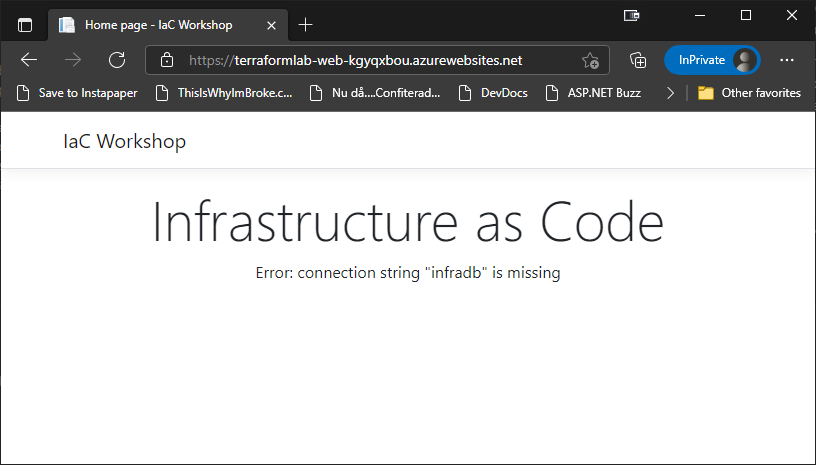

# Infrastructure as Code Labs - Pulumi - TypeScript

Welcome to the Pulumi lab for the Infrastructure as Code workshop. In this lab, you will set up of the following infrastructure resources in Azure using Pulumi, and validate your deployed infrastructure using a pre-built web application along the way:

* Azure App Service running on Linux
* Azure Key Vault for storing sensitive information, such as passwords
* Azure SQL Server and a SQL database
* Application Insights resource backed by a Log Analytics workspace

## WARNING: Known issues

There are unfortunately known issues with this lab. 

Because Pulumi auto generates its SDK, with multiple Azure API versions, the TypeScript SDK tends to grow and become a bit hard to work with. Because of this, it is recommended to not import the full `@pulumi/azure-native` module as this lab suggests. Instead, import only the modules that you need, to keep the TypeScript compiler a bit more happy.

There is also a known issue around setting the resource's parent. So, ignore all the `{ parent = X }` entries in this lab to make it work properly.

__Note:__ Another option is to use the [package.json](../pulumi/typescript/package.json) and [package-lock.json](../pulumi/typescript/package-lock.json) files from this repo, as these include references to older versions of Pulumi, that work as intended. Even if they are a bit on the slow side...

Proceed with caution, there be dragons... ;)

## Prerequisites

To complete the lab you need to install the Pulumi tooling which include

* Azure CLI
* Visual Studio Code 
* Node (LTS)
* Pulumi

You can find the latest installation instructions for your environment here:

* Azure CLI - https://docs.microsoft.com/en-us/cli/azure/install-azure-cli
* Visual Studio Code - https://code.visualstudio.com/download
* Node - https://nodejs.org/en/download/
* Pulumi - https://www.pulumi.com/docs/get-started/install/

__Note:__ Pulumi can be installed using Chocolatey, which is a terrific way to do it. To install Chocolatey, have a look at: https://chocolatey.org/install

__Suggestion:__ If you need to use different Node versions, have a look at nvm for Linux https://github.com/nvm-sh/nvm, and nvm-windows for Windows https://github.com/coreybutler/nvm-windows

Once you have the tools installed, you can verify that the CLI parts are working by running:

```bash
> az version
{
  "azure-cli": "2.28.0",
  "azure-cli-core": "2.28.0",
  "azure-cli-telemetry": "1.0.6",
  "extensions": {}
}

> pulumi version
v3.48.0

> node --version
v18.12.1
```

With the tools in place, you need to either log in to the Azure CLI, or, if you are already logged in, validate that you are using the correct subscription.

To log in, run the following command, and go through the login procedure

```bash
> az login
```

To validate that you are using the correct subscription, you can run

```bash
> az account show
{
  ...
  "id": "XXXXXXXX-XXXX-XXXX-XXXX-XXXXXXXXXXXX",
  ...
  "name": "My Subscription"
}
```

If this is not the required subscription, you can list the available subscriptions by running

```bash
> az account list
```

and select the subscription you want by running

```bash
> az account set -s <SUBSCRIPTION ID>
```

## Setting up the project

Create a new folder for you Pulumi project and open the folder in Visual Studio Code. 

The first step is to "log in" Pulumi to tell it where to store its state. For this lab, you will store your state in the local folder, which you can tell Pulumi by opening up the terminal and executing

```bash
> pulumi login file://.
```

__Note:__ You can also store the state using the Pulumi online service, Azure Blob Storage, AWS S3 etc. You can also store the state in a sub-folder of your profile (~/.pulumi) using `pulumi login --local`

Once the state storage has been configured, you can start a new Pulumi project using the following command

```bash
> pulumi new azure-typescript
```

This will ask you a few questions that are used to set up the project. Use the following settings

* project name - PulumiLab
* project description - Leave as is by pressing Enter
* stack name - Leave as __dev__ by pressing Enter
* passphrase - this is used to protect the config. Choose a passphrase you will remember
* Azure location - use whatever region is closest to you

__Note:__ To get a list of all the regions you can run `az account list-locations -o table`

This will create a brand new Pulumi project called __PulumiLab__, configured to use TypeScript and Node, and be set up to create resources in Azure. It will also run `npm install` to install the dependencies needed, so that when the command finishes, you are good to go.

Once the `npm install` has completed, you can open the project in VS Code by running

```bash
> code .
```

You should end up with a file explorer, that looks like this


__Note:__ There are several more languages and "targets" that can be managed using Pulumi, but for this lab it will be TypeScript and Azure.

## Azure App Service

To run a web application on Azure App Service, you need an app service plan and an app service. 

However, before you can create these resources, you need a Resource Group to put it in. In Pulumi, that means creating an instance of `ResourceGroup`.

If you open up the __index.ts__ file, you will see that there are already a couple of resources defined. Among them, a Resource Group that looks like this

```typescript
const resourceGroup = new resources.ResourceGroup("resourceGroup");
```

Let's use that resource group, but change the name to __PulumiLab__. And while you are at it, you might as well clean up the file a bit, since you aren't going to use any storage account. In the end, your file should look like this

```typescript
import * as pulumi from "@pulumi/pulumi";
import * as resources from "@pulumi/azure-native/resources";

const resourceGroup = new resources.ResourceGroup("PulumiLab");
```

__Note:__ The Azure location is automatically picked up from the __Pulumi.dev.yaml__ file, which contains the value you entered during the creation of the project.

Now that you have a place to put your App Service Plan and App Service, you can turn your focus to defining these.

To create the app service plan, you need to instantiate another class. In this case an AppServicePlan. However, the AppServicePlan class is in another package called `@pulumi/azure-native/web`. 

You now have 2 options. Either, you add another import for this new package, or, you simply change the current __resources__ import to point to `@pulumi/azure-native` and rename the import to __azure__. The latter will give you full access to everything in the `@pulumi/azure-native` package, instead of just individual parts. The former will give you more control, and slightly shorter definitions. It's up to you, but the lab will opt for the `@pulumi/azure-native` way. This means updating the existing code to look like this

```typescript
import * as pulumi from "@pulumi/pulumi";
import * as azure from "@pulumi/azure-native";

const resourceGroup = new azure.resources.ResourceGroup("PulumiLab");
```

With that out of the way, you can focus on creating the App Service Plan, and App Service. These are created just like the Resource Group, however, they require a bit more configuration, which is passed in as a second object literal parameter called __args__.

First up is the App Service Plan, which is defined using the `azure.web.AppServicePlan` type, and requires you to set the following properties in *index.ts*:

* `resourceGroupName` - the `name` property of the resource group resource
* `kind` - the string "linux"
* `reserved` - has to be __true__ for a Linux plan
* `sku` - an object with `name`, `size` and `tier` properties, set to __F1__, __F1__ and __Free__

Like this

```typescript
...

const appSvcPlan = new azure.web.AppServicePlan("PulumiLab", {
    resourceGroupName: resourceGroup.name,
    kind: "linux",
    reserved: true,
    sku: {
        name: "F1",
        size: "F1",
        tier: "Free"
    }
})
```
__Note:__ If you want to know more about what properties are available for configuration on the AppServicePlan type, have a look at: https://www.pulumi.com/docs/reference/pkg/azure-native/web/appserviceplan/

The name of the constant can be anything you want, but the lab will assume it is __appSvcPlan__. If you choose another name, just remember to substitute it when the plan is referenced in future parts of the lab.

Luckily, TypeScript uses static typing, so the editor is able to give you a lot of help. Just use `Ctrl + Space`, and VS Code will tell you what you can do. And if you are doing it wrong, you will get a red squiggly.


But before we go any further, there is one thing to note when it comes to naming. And that is that Pulumi is very opinionated when it comes to naming. It firmly believes you should be using "cattle based" naming. 

What does this mean? Well, it means that the name you give the resource by using the first constructor parameter is the "logical" name. This is used internally in Pulumi, and used as the base for the "physical" name. That is the name of the actual resource that is being created. This name consists of the logical name with 8 random characters appended to the end. 

So if you were to deploy this to Azure, the resources would end up being named something like __PulumiLab7f9e86f8__, which is awesome for most resources, but not for all.

For example, it's often nicer if the resource group is named without the suffix. Luckily, this is easily fixed by adding an __args__ parameter that sets the `resourceGroupName` property. Setting this property will override the auto-generated name.

```typescript
...
const resourceGroup = new azure.resources.ResourceGroup("PulumiLab", {
    resourceGroupName: "PulumiLab"
});
...
```

This will make sure that the resource group is named as you want it, without the suffix.

In most cases, it is a good idea to have some form of naming strategy. In most cases this strategy includes a "base" or "project" name, the resource type and a "random" suffix. And in a lot of cases it also includes the "environment", for example "dev" or "prod".

Being that Pulumi is just TypeScript, you can extract this naming strategy into a TypeScript function that looks like this

```typescript
function getName(resourceType: string) {
    return `${pulumi.getProject().toLowerCase()}-${resourceType}-`
}
```

This uses the return value from the `pulumi.getProject()` method to retrieves the project name that you defined when you created the Pulumi project. This is then turned into lower-case, as some resources require the name to be lower-case letters only, before a separator, the resource type and another separator is appended to it.

__Comment:__ The trailing dash (`-`) is there because Pulumi adds the suffix to the name without any separator.

__Note:__ As mentioned, it is often a good idea to include environment in the naming strategy as well. With Pulumi, this is often done by using the stack name, as this allows you to deploy multiple environments using different stacks.

Now that you have a function to generate names, you can update the app service plan name to use the `getName()` function like this

```typescript
const appSvcPlan = new azure.web.AppServicePlan(getName("plan"), {
    ...
});
```

__Note:__ Yes, this uses a very simple naming strategy that assumes a single instance of each resource type. If this is not enough, you can also update the `getName()` method to accept more parameters and use them to create a more complex naming strategy.

Now that the naming strategy is in place, it's time to have a look at the web app. 

An Azure Web App is represented by the type `azure.web.WebApp`, which requires you to set a bunch of properties, starting with the following

* logical name - `getName("web")`
* `resourceGroupName` - the `name` property of the resource group resource
* `serverFarmId` - the `id` property of the app service plan instance

Like this

```typescript
const app = new azure.web.WebApp(getName("web"), {
    resourceGroupName: resourceGroup.name,
    serverFarmId: appSvcPlan.id
});
```

__Note:__ Don't forget that you can use `Ctrl + Space` to get information about what properties you can set.

Next, you need to configure the app to use a Docker image called `iacworkshop.azurecr.io/infrawebapp:v1`. To do this, you need to set the `linuxFxVersion` property of the `siteConfig` value to `DOCKER|iacworkshop.azurecr.io/infrawebapp:v1`

```typescript
const app = new azure.web.WebApp(getName("web"), {
    ...,
    siteConfig: {
        linuxFxVersion: "DOCKER|iacworkshop.azurecr.io/infrawebapp:v1"
    }
});
```

This should make sure that the correct image is used for the application. However, as this image is hosted on a private Azure Container Registry repo you need to tell the web app what credentials to use when accessing the registry. This is done by setting the following 3 app settings on the web app

* DOCKER_REGISTRY_SERVER_URL - "https://iacworkshop.azurecr.io"
* DOCKER_REGISTRY_SERVER_USERNAME - "iacworkshop"
* DOCKER_REGISTRY_SERVER_PASSWORD - Ask for this

To set the web app's app settings, you need to set the `siteConfig`'s `appSettings` property to an array of objects containing a `name` and a `value` property. Like this

```typescript
const app = new azure.web.WebApp(getName("web"), {
    ...,
    siteConfig: {
        ...,
        appSettings: [
            { name: "DOCKER_REGISTRY_SERVER_URL", value: "https://iacworkshop.azurecr.io"},
            { name: "DOCKER_REGISTRY_SERVER_USERNAME", value: "iacworkshop"},
            { name: "DOCKER_REGISTRY_SERVER_PASSWORD", value: "XXX"}
        ]
    }
});
```

Since you are configuring the app service plan to use the Free tier, you also need to turn off "Always On" and set the worker process to be 32-bit. 

This is done using the `alwaysOn` and `use32BitWorkerProcess` properties on the `siteConfig` object.

```typescript
const app = new azure.web.WebApp(getName("web"), {
    ...,
    siteConfig: {
        ...,
        alwaysOn: false,
        use32BitWorkerProcess: true
    }
});
```

That's almost it. The last step is to configure the app to use a "System Assigned Identity". This will allow the application to authenticate against Azure resources without having to have access to credentials. 

Configuring this is a matter of setting the `identity` property to an object with a `type` property set to `"SystemAssigned"`. Or, you could use an enum called `azure.types.enums.web.ManagedServiceIdentityType`, which will make it nicely typed as well.

```typescript
const app = new azure.web.WebApp(getName("web"), {
    ...,
    identity: {
        type: azure.types.enums.web.ManagedServiceIdentityType.SystemAssigned
    }
});
```

__Note:__ If you want to know more about what properties are available for configuration on the WebApp type, have a look at: https://www.pulumi.com/docs/reference/pkg/azure-native/web/webapp/

__Note:__ If you use `Ctrl + Space` when setting this value, VS Code will use the string version, which is fine.

You should now have a TypeScript file that looks like this

```typescript
import * as pulumi from "@pulumi/pulumi";
import * as azure from "@pulumi/azure-native";

function getName(resourceType: string) {
    return `${pulumi.getProject().toLowerCase()}-${resourceType}-`
}

const resourceGroup = new azure.resources.ResourceGroup("PulumiLab", {
    resourceGroupName: "PulumiLab"
});

const appSvcPlan = new azure.web.AppServicePlan(getName("plan"), {
    resourceGroupName: resourceGroup.name,
    kind: "linux",
    reserved: true,
    sku: {
        name: "F1",
        size: "F1",
        tier: "Free"
    }
});

const app = new azure.web.WebApp(getName("web"), {
    resourceGroupName: resourceGroup.name,
    serverFarmId: appSvcPlan.id,
    siteConfig: {
        linuxFxVersion: "DOCKER|iacworkshop.azurecr.io/infrawebapp:v1",
        appSettings: [
            { name: "DOCKER_REGISTRY_SERVER_URL", value: "https://iacworkshop.azurecr.io"},
            { name: "DOCKER_REGISTRY_SERVER_USERNAME", value: "iacworkshop"},
            { name: "DOCKER_REGISTRY_SERVER_PASSWORD", value: "XXX"}
        ],
        alwaysOn: false,
        use32BitWorkerProcess: true
    },
    identity: {
        type: "SystemAssigned"
    }
});
```

The program is now at a point where you can to use

```bash
> pulumi up
```

This command will output a definition of what resources it will create, and ask you whether to proceed or not, and if a passphrase was set, it will ask you for that.

__Note:__ An interactive prompt like this is not a great solution for a non-interactive scenario like for example a deployment pipeline. In these scenarios, you can append `-y` to automatically approve the changes.

The output should look something like this

```
Previewing update (dev):
     Type                                     Name             Plan
 +   pulumi:pulumi:Stack                      PulumiLab-dev    create     
 +   ├─ azure-native:resources:ResourceGroup  PulumiLab        create     
 +   ├─ azure-native:web:AppServicePlan       pulumilab-plan-  create     
 +   └─ azure-native:web:WebApp               pulumilab-web-   create     

Resources:
    + 4 to create

Do you want to perform this update?  [Use arrows to move, enter to select, type to filter]
  yes
> no
  details
```

Select __no__ here, as there is one more thing to solve before doing the deployment.

You might not notice it in this output, but resources in Pulumi have a logical hierarchy. In this case, there is no real hierarchy defined. All resources are considered children of the Pulumi stack. However, there is a logical hierarchy among the resources we have defined. The App Service Plan is "under" the Resource Group. And the Web App is "under" the plan. This can be visualized in Pulumi by __adding__ a 3rd constructor parameter of type object, and setting its `parent` property to the parent object. Like this

```typescript
const appSvcPlan = new azure.web.AppServicePlan(getName("plan"), {
    ...
}, {
    parent: resourceGroup
});

const app = new azure.web.WebApp(getName("web"), {
    ...
}, {
    parent: appSvcPlan
});
```

Now you can try and run `pulumi up` again.

```
Previewing update (dev):
     Type                                     Name             Plan
 +   pulumi:pulumi:Stack                      PulumiLab-dev    create
 +   └─ azure-native:resources:ResourceGroup  PulumiLab        create
 +      └─ azure-native:web:AppServicePlan    pulumilab-plan-  create
 +         └─ azure-native:web:WebApp         pulumilab-web-   create

Resources:
    + 4 to create

Do you want to perform this update?  [Use arrows to move, enter to select, type to filter]
  yes
> no
  details
```

As you can see (if you compare it to the previous output), the resources are now treated as a hierarchy, which is just what we wanted.

Go ahead and answer __yes__ to deploy the defined infrastructure.

You should now end up with a resource group called __PulumiLab__ that looks something like this in the Azure Portal


During the deployment, the current state will be added in JSON-format to a file called __dev.json__ (`<STACK NAME>.json`), under the __./.pulumi/stacks/__ directory. 

__Note:__ The next time you run `pulumi up`, the contents of the state file will be added to a new file called __dev.json.bak__ which contains the state for previous deployments, and the new state added to the __dev.json__ file.

To test the web app, you need to find out what hostname was assigned to it. To find this, run 

```bash
> az webapp list -o table
```

Locate your web app and browse to the URL shown in the _DefaultHostName_ column


__Note:__ It can take a couple of minutes for the web app to come online

## Parameterize project

Instead of hard coding various values in the project, such as the App Service Plan SKU, we can extract them into parameters that are stored "in" the stack, or the stack configuration. This allows us to create multiple stacks with different configuration, and use the same project to deploy to multiple environments based on the stack (dev, test, prod) with different configuration in each environment.

Configuration variables are stored per stack in files called __Pulumi.<STACK_NAME>.yaml__. Inside these files, you will do two parts. First, you will see an `encryptionsalt` that is used to decode the content using the passphrase you have selected. Secondly, you will find a section called `config` that contains all the configuration for this stack. 

Each config value is prefixed in some way. Local configurations are prefixed with the name of the current Pulumi project, __PulumiLab__ in this case. And all non-local variables are prefixed with the name of the package they belong to. 

In the current __Pulumi.dev.yaml__ file, you will find the following content

```yaml
encryptionsalt: v1:6XEI+gHtvAA=:v1:gMkU1KqRnYa71DOn:RIB07x/onWgMj3A+ZXt6fLrdjceB1Q==
config:
  azure-native:location: westeurope
```

You can ignore the `encryptionsalt`, and just look at the `azure-native:location` entry. As you can see, it is a config called `location`, used by the `azure-native` package, and the value is whatever Azure location you chose during the creation of the project.

There are 2 ways to manage stack configuration values in Pulumi. The first one is to simply open the file __Pulumi.<STACK_NAME>.yaml__ file, and add a new line, or update an existing one, under the `config` section. For example, to set a local config called __appServicePlanTier__ to "Free", you can open the __Pulumi.dev.yaml__ file and update it, so that it looks like this

```yaml
encryptionsalt: v1:6XEI+gHtvAA=:v1:gMkU1KqRnYa71DOn:RIB07x/onWgMj3A+ZXt6fLrdjceB1Q==
config:
  PulumiLab:appServicePlanTier: Free
  azure-native:location: westeurope
```

The other way is to use the Pulumi CLI. To add a config called __appServicePlanSize__ to "F1", you can use the following command

```bash
> pulumi config set appServicePlanSize F1
```

You are potentially met with the following error message when doing this

> error: constructing secrets manager of type "passphrase": unable to find either `PULUMI_CONFIG_PASSPHRASE` or `PULUMI_CONFIG_PASSPHRASE_FILE` when trying to access the Passphrase Secrets Provider; please ensure one of these environment variables is set to allow the operation to continue

If that is the case, the easiest way to get around this, is to do what it says and set the `PULUMI_CONFIG_PASSPHRASE` environment variable.  

If you are using PowerShell you do that by executing

```powershell
> $env:PULUMI_CONFIG_PASSPHRASE = "<YOUR PASSPHRASE>"
```

And then re-run 

```bash
> pulumi config set appServicePlanSize F1
```

After this command has been run, your YAML file should include a new __appServicePlanSize__ configuration

 ```yaml
encryptionsalt: v1:6XEI+gHtvAA=:v1:gMkU1KqRnYa71DOn:RIB07x/onWgMj3A+ZXt6fLrdjceB1Q==
config:
  PulumiLab:appServicePlanSize: F1
  PulumiLab:appServicePlanTier: Free
  azure-native:location: westeurope
```

__Note:__ Using the CLI offers some interesting benefits. For example, you can add the `--secret` parameter to the `pulumi config set` command. This encrypts the config value in the YAML file, allowing you to store secrets inside the configuration. This is also why you need the passphrase every time Pulumi needs to read the config file.

With the config in place, you can update the resources in the __index.ts__ file to use them instead of the hard-coded values. However, to get hold of the configuration, you need to create an instance of `pulumi.Config()`. This instance can then be used to retrieve config values as needed

```typescript
...
const config = new pulumi.Config();
...
const appSvcPlan = new azure.web.AppServicePlan(getName("plan"), {
    ...
    sku: {
        name: config.require("appServicePlanSize"),
        size: config.require("appServicePlanSize"),
        tier: config.require("appServicePlanTier")
    }
}, ...);
...
```

However, now that we might not be using the Free tier, we should also make sure to update the `alwaysOn` and `use32BitWorkerProcess` properties on the web app, since the current settings are less than optimal and only there because the Free tier doesn't support certain features.

So, instead of hard-coding them to these less than optimal settings, we can use the power of TypeScript and just add a couple of conditionals. Like this

```typescript
...
const isFreeTier = config.require("appServicePlanTier").toLowerCase() == "free";

const app = new azure.web.WebApp(getName("web"), {
    ...
    siteConfig: {
        ...,
        alwaysOn: !isFreeTier,
        use32BitWorkerProcess: isFreeTier
    },
    ...
}, ...);
```

This will make sure that the values are set to the optimal values based on the chosen tier.

Just to verify that nothing has really changed, as you have only refactored the existing code a bit, you can run

```bash
> pulumi up
```

The output from this should say that there are no changes.

## Storing and accessing secrets with Azure Key Vault

Before you set up the SQL Server resources, you are going to create an Azure Key Vault to store sensitive information. In this case it will store a single one secret that will be used by the application.

Once again, it is just a matter of instantiating a new resource. In this case a `azure.keyvault.Vault`. The Key Vault resource needs the following resources to be set

* logical name - `getName("kv")`
* `resourceGroupName` - the `name` of the __resourceGroup__ resource
* `properties` - an object containing the Key Vault configuration

```typescript
const kv = new azure.keyvault.Vault(getName("kv"), {
    resourceGroupName: resourceGroup.name,
    properties: {
        
    }
})
```

The properties that need to be set in are 

* `tenantId` - the ID of the tenant that should be used for authentication
* `sku` - an object defining a `family` and a `name` for the SKU to use

The `tenantId` should be the ID of the tenant that the current client is part of. The way to get hold of this, is to use the `azure.authorization.getClientConfig()`. This method returns a TypeScript Promise<T> containing the currently used client configuration. However, since we only need the tenant ID, we need to do some async stuff. 

The Pulumi way of handling this is to pass the Promise<T> to the `pulumi.output()` method to turn it into an "output". This is a Pulumi abstraction that helps out when working with async values. It gives you an object that looks like it is synchronous, but handles the asynchronous using Pulumi "magic". So to set the `tenantId` property, you can use `pulumi.output(azure.authorization.getClientConfig()).tenantId`.

__Note:__ You can find out about Pulumi's `Output<T>` (and Input<T>) at: https://www.pulumi.com/docs/intro/concepts/inputs-outputs/

For the `sku` property, you just need to set it to an object containing the `family` and `name` set to the correct values. In this case, that means setting the `family` property to `A`, and the `name` property to `standard`. Or, you can use the built in enums like this

```typescript
const kv = new azure.keyvault.Vault(getName("kv"), {
    ...
    properties: {
        tenantId: pulumi.output(azure.authorization.getClientConfig()).tenantId,
        sku: {
            family: azure.keyvault.SkuFamily.A,
            name: azure.keyvault.SkuName.Standard
        }
    }
})
```

__Note:__ You can find more information about the `Vault` type at: https://www.pulumi.com/docs/reference/pkg/azure-native/keyvault/vault/

It would also be nice if the logical hierarchy, also applies to the Key Vault, so it is logically placed under the resource group, when shown. To fix this, you can just set the `parent` property to the resource group

```typescript
const kv = new azure.keyvault.Vault(getName("kv"), {
    ...
}, {
    parent: resourceGroup
})
```

With the Key Vault in place, you can turn your focus towards adding the Key Vault secret that the application needs. 

To create a new Key Vault Secret, you need to create an instance of `azure.keyvault.Secret`. This type needs the following configuration to work

* logical name - "testSecret"
* `secretName` - as we can't have Pulumi suffix the name, this also needs to be set to "testSecret"
* `resourceGroupName` - the `name` of the __resourceGroup__ resource
* `vaultName` - the `name` property of the __kv__ resource
* `properties` - an object containing a single property called `value` set to "secretValue"

However, as you don't need to reference this resource in the future, there is no need to store the reference in a constant.

It should look something like this

```typescript
new azure.keyvault.Secret("testSecret", {
    resourceGroupName: resourceGroup.name,
    vaultName: kv.name,
    secretName: "testSecret",
    properties: {
        value: "secretValue",
    },
});
```

__Note:__ You can find more information about the `Secret` type at: https://www.pulumi.com/docs/reference/pkg/azure-native/keyvault/secret/

Once again the logical hierarchy, is missing. And once again, it is easily fixed by setting the `parent` property to the Key Vault

```typescript
new azure.keyvault.Secret("testSecret", {
    ...
}, {
    parent: kv
})
```

Now that you have the Key Vault and secret in place, you can try deploying the infrastructure again by running

```bash
> pulumi up
```

The result should be that it needs to add 2 resources, to which you can answer __yes__.

Unfortunately, this fails with the error

> error: Code="BadRequest" Message="The parameter accessPolicies is not specified."

The error is technically correct, but it doesn't explain what the problem is. 

The reason for the failure is that there is no access policy defined for the Key Vault, that gives the current user (you) permission to manipulate the secrets in the vault. 

To solve this, you need to add a Key Vault access policy that gives the current user permission to manipulate the Key Vault secrets.

This is done by setting the `accessPolicies` property of the `properties` object to an array containing the access policies you want. 

An access policy definition contains the `tenantId` and `objectId` of the account to provide permissions for, as well as a set of permissions that the account should have.

In this case, the account that needs the permissions is the current account, which is available through `azure.authorization.getClientConfig()`. And the permissions needed are "get", "list", "set" and "delete" permissions for secrets.

But let's start with the client config. This has already been used once, and is now going to be used two more times. So, to avoid repetition, you can move that value into a separate constant.

```typescript
const clientConfig = pulumi.output(azure.authorization.getClientConfig());

const kv = new azure.keyvault.Vault(getName("kv"), {
    ...
    properties: {
        tenantId: clientConfig.tenantId,
        ...
    }
})
```

Now that you have that information easily available, you can go ahead and add an array to the `accessPolicies` property. The content of the array should be a single object with `tenantId`, `objectId` and `permissions` properties set like this

```typescript
const kv = new azure.keyvault.Vault(getName("kv"), {
    ...,
    properties: {
        ...,
        accessPolicies: [
            {
                objectId: clientConfig.objectId,
                tenantId: clientConfig.tenantId,
                permissions: {
                    
                }
            }
        ]
    }
})
```

__Note:__ Don't forget the magic of `Ctrl + Space`

The permissions value should contain all the permissions to assign. In this case, as mentioned before, you need to assign permissions to secrets, which is done like this

```typescript
const kv = new azure.keyvault.Vault(getName("kv"), {
    ...,
    properties: {
        ...,
        accessPolicies: [
            {
                ...,
                permissions: {
                    secrets: [
                        "get",
                        "list",
                        "set",
                        "delete"
                    ]
                }
            }
        ]
    }
})
```

This allows the current user to access the Key Vault. However, that is only useful during deployment. When the app is running, the access will be done by the web app's system assigned managed identity. Because of this, you also need to add an access policy that allows the web app to read the secrets in the Key Vault. This is done by adding a second entry in the `accessPolicy` list. In this case, the `tenantId` and `objectId` should be set to the web app's system assigned managed identity, which is available through the `identity` property on the __app__ constant.

In this case, the required permissions are "get" and "list" for secrets.

The problem with this is that the `identity` property won't be assigned until the resource has actually been created. Because of this, this property is defined as a `pulumi.Output<ManagedServiceIdentityResponse|undefined>`, which is Pulumi's way of handling async properties. To get a value from a `pulumi.Output<T>` instance, you can use the `apply()` method. This takes a callback that defines what property to read and returns another `pulumi.Output<T>`. Pulumi can then figure out that this is async, and act accordingly.

It looks like this

```typescript
const kv = new azure.keyvault.Vault(getName("kv"), {
    ...,
    properties: {
        ...,
        accessPolicies: [
            ...,
            {
                objectId: app.identity.apply(x => x!.principalId),
                tenantId: app.identity.apply(x => x!.tenantId),
                permissions: {
                    secrets: [
                        "get",
                        "list"
                    ]
                }
            }
        ]
    }
})
```

__Note:__ The `x!` is there because the x is defined as `ManagedServiceIdentityResponse|undefined`. `undefined` is not valid for the properties that are being assigned, so by adding a `!`, you are telling TypeScript that you know that the x variable _does_ have a value.

With the Key Vault and the correct permissions in place, you also need to tell the web app the name of the Key Vault, so it knows where to look for it. For this, the app expects an app setting called __KeyVaultName__ to contain the name of the Key Vault.

Unfortunately, with the current configuration, it is impossible to reference the Key Vault during the configuration of the web app, as it has yet to be defined. And moving it so that it is defined before the app will cause problems with the Key Vault configuration since that references the app. A classic case of a cyclic dependency. Instead, the solution is to break out the app settings from the wep app resource, and set it using a separate `azure.web.WebAppApplicationSettings` resource.

The `azure.web.WebAppApplicationSettings` needs the following settings defined

* logical name - __AppSettings__
* `name` - the name of the web app
* `resourceGroupName` - the name of the resource group the web app is located in
* `properties` - an object literal with the settings that you wish to set.
* parent - __app__

Starting with the move of the existing app settings, you end up with something that looks like this

```typescript
new azure.web.WebAppApplicationSettings("AppSettings", {
    name: app.name,
    resourceGroupName: app.resourceGroup,
    properties: {
        "DOCKER_REGISTRY_SERVER_URL": "https://iacworkshop.azurecr.io",
        "DOCKER_REGISTRY_SERVER_USERNAME": "iacworkshop",
        "DOCKER_REGISTRY_SERVER_PASSWORD": "XXX"
    }
}, {
    parent: app
});
```

Next, you can go ahead and add the __KeyVaultName__ setting. Like this

```typescript
new azure.web.WebAppApplicationSettings("AppSettings", {
    name: app.name,
    resourceGroupName: app.resourceGroup,
    properties: {
        ...,
        "KeyVaultName": kv.name
    }
}, {
    parent: app
});
```

Don't forget to remove the `appSettings` property from the web app definition. This will be overridden by this new config, but it looks odd to have it in both places.

Now, you can try deploying the infrastructure again using

```bash
> pulumi up
```

Once that is done, you can try to refresh the web app in the browser to verify that it can successfully read the secret from the vault now.



## Add SQL storage

The web application uses SQL Server database for data storage, so you need to create an Azure SQL Server and an Azure SQL Database as part of you infrastructure.

A part of setting up the SQL Server is setting up an admin user. For this, you need to create a username and a password. For the password, you can use the `RandomPassword` class from the `@pulumi/random` package. Unfortunately, the `@pulumi/random` package isn't added to the project by default. So you have to use __npm__ to install it

```bash
> npm install @pulumi/random
```

Once the package has been added, you just need to import it in the TypeScript file and create a new instance of `RandomPassword` with the following arguments

* logical name - "sqlAdminPassword"
* `length` - 16
* `special` - true

Like this

```typescript
...
import * as random from "@pulumi/random";
...
const password = new random.RandomPassword("sqlAdminPassword", {
    length: 16,
    special: true
});
```

The actual password string is available through the `result` property.

__Note:__ You can find more information about the `RandomPassword` at: https://www.pulumi.com/docs/reference/pkg/random/randompassword/

With the password set up, you can carry on with the creation of the SQL Server instance. For this, you will need a new instance of `azure.sql.Server`, with a reference stored in a constant called __sqlServer__. The properties you need to set for this resource are

* logical name - `getName("sql")`
* `resourceGroupName` - the `name` property of the resource group resource
* `administratorLogin` - "infraadmin"
* `administratorLoginPassword` - the random password (`password.result`)

It should look something like this when you are done

```typescript
const sqlServer = new azure.sql.Server(getName("sql"), {
    resourceGroupName: resourceGroup.name,
    administratorLogin: "infraadmin",
    administratorLoginPassword: password.result
});
```

And don't forget to explicitly set the parent/child hierarchy

```typescript
const sqlServer = new azure.sql.Server(getName("sql"), {
    ...
}, {
    parent: resourceGroup
});
```

__Note:__ If you are interested in what else you can configure on the SQL Server, have a look at: https://www.pulumi.com/docs/reference/pkg/azure-native/sql/server/

The next step is to add the SQL Server database to the server. And as usual, that means creating another resource instance. In this case a `azure.sql.Database`, stored in a constant called __db__. For the database resource, you need to set

* logical name - `getName("db")`
* databaseName - "infradb"
* resourceGroupName - the `name` property of the resource group resource
* serverName - the name of the __sqlServer__ resource
* collation - "SQL_Latin1_General_CP1_CI_AS"
* sku - an object containing a `name` property set to "Basic"
* maxSizeBytes - 1 * 1024 * 1024 * 1024 (1Gb)
* parent - __sqlServer__

```typescript
const db = new azure.sql.Database(getName("db"), {
    databaseName: "infradb",
    resourceGroupName: resourceGroup.name,
    serverName: sqlServer.name,
    collation: "SQL_Latin1_General_CP1_CI_AS",
    sku: {
        name: "Basic"
    },
    maxSizeBytes: 1 * 1024 * 1024 * 1024
}, {
    parent: sqlServer
});
```

Now you have the web app and the database defined, but you still need to make sure that the web app can talk to the database. This requires three things, a connection string for the web app to use, the necessary permissions for the web app's assigned identity to access the database, and that the firewall to the SQL Server is opened to allow traffic to access it. Let's start with the connection string. 

The first part, adding a connection string setting to the web app, is normally done by setting the `connectionStrings` property of the web app's `siteConfig` value. Unfortunately, trying to reference the SQL Server in the web app configuration would cause a cyclic dependency situation. Because of this, you will have to use a separate resource for this, just like you did with the app settings. In this case the type is `azure.web.WebAppConnectionStrings`. 

Just as with the app settings, the new resource requires

* logical name - __ConnectionStrings__
* `name` - the name of the web app
* `resourceGroupName` - the name of the resource group the web app is located in
* `properties` - an object literal with one property per connection string to set. Each containing a `type` and a `value` property
* parent - __app__

It looks like this

```typescript
new azure.web.WebAppConnectionStrings("ConnectionStrings", {
    name: app.name,
    resourceGroupName: app.resourceGroup,
    properties: {
        "infradb": {
            type: azure.types.enums.web.ConnectionStringType.SQLAzure,
            value: pulumi.interpolate `Data Source=tcp:${sqlServer.name}.database.windows.net,1433;Initial Catalog=infradb;Authentication=Active Directory Interactive;`
        }
    }
}, {
    parent: app
});
```

In this case, you are setting up a connection string called __infradb__, setting the type to `azure.types.enums.web.ConnectionStringType.SQLAzure` (or "SQLAzure" if you prefer that), and the `value` to the connection string to the database.

However, the actual connection string is worth having a look at. It uses this weird syntax ``pulumi.interpolate `Data Source=tcp:${sqlServer.name}...``. The reason for this is that the __sqlServer.name__ is an async `Output<string>`. This means that you can't just concatenate it with a string. Instead, you can use this syntax where you use the built-in TypeScript string interpolation using backticks, but prefixing it with `pulumi.interpolate` to have Pulumi do the magic.

__Note:__ You could also use the `apply()` function like this ``sqlServer.name.apply(x => `Data Source=tcp:${x}.database.windows.net,1433;Initial Catalog=infradb;Authentication=Active Directory Interactive;`)``

The second part is to give the web app's assigned identity access to the database. In this case, you will do this by making it the Active Directory admin of the Azure SQL Server.

__Warning:__ It is not recommended making an app's managed identity the SQL Server admin as it will give full access to the entire server. However, for the sake of simplicity, this is what you will be doing in this lab. In a real world scenario you should create and use a less privileged SQL Server user for the identity.

To set the SQL Server's Azure AD administrator, you need to set the `administrators`property on the SQL Server resource. The `administrators` property is defined as an object that requires the following properties to be set

* `login` - the SQL Server login name for the Azure AD administrator, in this case the name of the web app
* `sid` - SID (object ID) of the AD user account to use, in this case the principal ID of the web app's assigned identity

Like this

```typescript
const sqlServer = new azure.sql.Server(getName("sql"), {
    ...,
    administrators: {
        login: app.name,
        sid: app.identity.apply(x => x!.principalId)
    }
}, ...);
```

The last part to make this work, is to open the SQL Server firewall for incoming traffic. In this case, you will configure it to allow traffic from all Azure based IP addresses. For this, you need to create an `azure.sql.FirewallRule` instance. It requires you to set 5 properties

* logical name - "AllowAllWindowsAzureIps"
* `firewallRuleName` - "AllowAllWindowsAzureIps" (to skip Pulumi's auto-naming)
* `serverName` - the name of the SQL Server
* `resourceGroupName` - the name of the resource group
* `startIpAddress` & `endIpAddress` - should both be set to "0.0.0.0" to allow all Azure traffic though
* parent - __sqlServer__

And since you don't need to reference it anywhere, you don't need to store the reference in a constant. So it ends up looking like this

```typescript
new azure.sql.FirewallRule("AllowAllWindowsAzureIps", {
    firewallRuleName: "AllowAllWindowsAzureIps",
    serverName: sqlServer.name,
    resourceGroupName: resourceGroup.name,
    startIpAddress: "0.0.0.0",
    endIpAddress: "0.0.0.0",
}, {
    parent: sqlServer
});
```

__Note:__ For more information about the `FirewallRule` type, have a look at: https://www.pulumi.com/docs/reference/pkg/azure-native/sql/firewallrule/

Now, re-run `pulumi up`, and then refresh the web page. It should now be able to connect to the database.


## Add Application Insights

The last piece of this infrastructure puzzle, is the addition of the Application Insights monitoring of the web app. You will also make sure to use the later version of this feature, and set it up to store its data in a Log Analytics Workspace for further analysis.

The first step is to add the Log Analytics Workspace. And as usual, that requires you to instantiate another resource. In this case it's an `azure.operationalinsights.Workspace` instance that needs to be created, and stored in a constant called __laws__. 

It requires the following properties

* logical name - `getName("laws")`
* `resourceGroupName` - the name of the resource group
* parent - the resource group

In the end it should be a very simple resource that looks like this

```typescript
const laws = new azure.operationalinsights.Workspace(getName("laws"), {
    resourceGroupName: resourceGroup.name,
}, {
    parent: resourceGroup
});
```

__Note:__ If you want to know what other configuration you can do to the workspace, have a look at: https://www.pulumi.com/docs/reference/pkg/azure-native/operationalinsights/workspace/

With the storage in place, you can go ahead and add the Application Insights resource. Unfortunately the default imports from the `@pulumi/azure-native` package doesn't support Workspace-based Application Insights. However, Pulumi is dynamically built based on the Azure API, so there is definitely support for it. However, it is a bit hidden. 

To get hold of a newer version of the Application Insights resource, you need to manually tell Pulumi which API version you want to use. And you do this by importing a specific API version like this

```typescript
import * as insights from '@pulumi/azure-native/insights/v20200202';
```

With that import in place, you can go ahead and create the Application Insights resource. This requires you to instantiate an instance of `insights.Component`, using the following properties

* logical name - `getName("ai")`
* `resourceGroupName` - the name of the resource group
* `workspaceId` - the ID of the __laws__ workspace
* `applicationType` - "web"
* parent - the web app

Turning the instantiation into this

```typescript
const ai = new insights.Component(getName("ai"), {
    resourceGroupName: resourceGroup.name,
    workspaceResourceId: laws.id,
    applicationType: "web",
    kind: "web"
}, {
    parent: app
})
```

__Note:__ The full spec for this resource is available at: https://www.pulumi.com/registry/packages/azure-native/api-docs/insights/component/

The final step in the addition of the Application Insights monitoring is to connect the web app to the Log Analytics resource. This is done by setting some "well-known" app settings for the web app. And these are 

* APPINSIGHTS_INSTRUMENTATIONKEY - set to the Application Insights resource's `instrumentationKey` property
* APPLICATIONINSIGHTS_CONNECTION_STRING - set to the Application Insights resource's `connectionString` property
* ApplicationInsightsAgent_EXTENSION_VERSION - should be `~3` for Linux-based servers, and `~2` for Windows-based ones. So `~3` for this lab
* XDT_MicrosoftApplicationInsights_Mode - should be `recommended` for recommended settings

However, before we add these app settings to the `azure.web.WebAppApplicationSettings` instance, you need to make sure you move it to the end of the file. Or at least move it after the `insights.Component` instantiation.

Once that is done, you can add the settings like this

```typescript
new azure.web.WebAppApplicationSettings("AppSettings", {
    name: app.name,
    resourceGroupName: app.resourceGroup,
    properties: {
        ...,
        "APPINSIGHTS_INSTRUMENTATIONKEY": ai.instrumentationKey,
        "APPLICATIONINSIGHTS_CONNECTION_STRING": ai.connectionString,
        "ApplicationInsightsAgent_EXTENSION_VERSION": "~3",
        "XDT_MicrosoftApplicationInsights_Mode": "recommended"
    }
}, ...);
```

You can now re-deploy the infrastructure and refresh the web page. It should now show you that your entire infrastructure is configured correctly.


## Add output variable

At the beginning of this lab, you went looking for the name of the web app using the `az webapp list` command. This is not very convenient, not to mention the fact that you'll often need this information later on in your deployment pipeline as well. For example when running smoke tests against a newly deployed web application.

The solution to this, is to find a way to programmatically convey this information from your code. And in Pulumi, that is made possible by using output values. These are pieces of information that are exported from the program to be made available outside the deployment after it has run. In this case the address to the web app.

To define an output value, you make use of TypeScript's `export` keyword, which allows you to output pieces of information from the current TypeScript module. Pulumi then catches these exported values and store them in the state.

The syntax is quite simple, you just write

```typescript
export const outputValue = "Hello World";
```

However, since you want to export the web app's `defaultHostName` property, which is an `Output<string>`, you will have to use either `apply()` or `pulumi.interpolate`. And since you will need to prefix the value with `https://` and suffix it with `/`, the `pulumi.interpolate` syntax is likely the cleanest. So it would look like this

```typescript
export const websiteAddress = pulumi.interpolate `https://${app.defaultHostName}/`;
```

Once you have added the exported value, you can re-deploy the infrastructure to get the output added to the Pulumi state.

When the re-deployment is completed, you can read the value by executing

```bash
> pulumi stack output websiteAddress

https://pulumilab-web-5d7dcf13.azurewebsites.net/
```

__Note:__ If you are interested in outputs, have a look at https://www.pulumi.com/docs/intro/concepts/inputs-outputs/

## Removing the infrastructure

Once you are done with the infrastructure you have set up, you can tear it all down by simply executing

```bash
> pulumi destroy
```

and confirming the removal of the resource by selecting __yes__ and pressing enter when asked.

## Lab Extension - Modularizing the resources

At this point, the infrastructure is pretty much done. However, it seems likely that you might be creating more web apps with Application Insights in this infrastructure. And with the current way of defining resources, this could potentially end up with a lot of duplicated code. The solution to this is to use a `pulumi.ComponentResource`. 

A `pulumi.ComponentResource` is basically a group of resources bundled together into a type of its own, allowing you to re-use it without code duplication. 

From a coding point of view, they are basically just TypeScript classes that inherit from `pulumi.ComponentResource`. And inside the constructor you create the resources you want in your "module".

The first step to creating a `WebApp` resource is to create a new TypeScript file called __web-app.ts__.  Inside this class, you need to import the required packages. In this case

```typescript
import * as pulumi from "@pulumi/pulumi";
import * as azure from "@pulumi/azure-native";
import * as insights from '@pulumi/azure-native/insights/v20200202';
```

Next, you need to define, and export the type you are needing. In this case the type should be called __WebAppWithApplicationInsights__, and inherit from `pulumi.ComponentResource`. Like this

```typescript
export class WebAppWithApplicationInsights extends pulumi.ComponentResource {
}
```

Next it needs a constructor. Preferably one that follows the Pulumi convention. This means creating a constructor that looks like this

```typescript
export class WebAppWithApplicationInsights extends pulumi.ComponentResource {
    constructor(name: string, props?: any, opts?: pulumi.ComponentResourceOptions) {
    }
}
```

The base class also has a constructor that should be called using the `super()` method. It accepts a "type name" that identifies this specific type, the name of the current instance, a set of arguments and a `pulumi.ComponentResourceOptions`. For the current resource, it could be called like this

```typescript
export class WebAppWithApplicationInsights extends pulumi.ComponentResource {
    constructor(name: string, props?: any, opts?: pulumi.ComponentResourceOptions) {
        super("PulumiLab:class:WebAppWithApplicationInsights", name, {}, opts)
    }
}
```

Once you have this boilerplate code in place, you need to set up the resources that should make up this "module". In this case, there are actually quite a few. But let's start with the `azure.web.WebApp`. 

Go ahead and move the `azure.web.WebApp` resource from the __index.ts__ file to inside the constructor of the `WebAppWithApplicationInsights` type. Like this

```typescript
export class WebAppWithApplicationInsights extends pulumi.ComponentResource {
    constructor(name: string, props?: any, opts?: pulumi.ComponentResourceOptions) {
        super("PulumiLab:class:WebAppWithApplicationInsights", name, {}, opts)

        const app = new azure.web.WebApp(getName("web"), {
            resourceGroupName: resourceGroup.name,
            serverFarmId: appSvcPlan.id,
            siteConfig: {
                linuxFxVersion: "DOCKER|iacworkshop.azurecr.io/infrawebapp:v1",
                alwaysOn: !isFreeTier,
                use32BitWorkerProcess: isFreeTier
            },
            identity: {
                type: "SystemAssigned"
            }
        }, {
            parent: appSvcPlan
        });
    }
}
```

As you might have noticed, there are a __lot__ of red squigglies since there is a lot of missing information that isn't available inside this type. 

The way to fix this is by adding input variables that contain the information that is needed. And Pulumi convention is that that information comes in as the second constructor parameter. The `props` one, which is currently defined as `any`. 

Having the `props` parameter be any is not a great user experience. To fix this, you can define an interface that it can be defined as, giving us type-safety.

In this case we need the following information to get rid of the red squigglies

* A name
* The ID of the App Service Plan
* The resource group name
* An indication of whether or not the plan is using the Free tier

This could be declared as an interface that looks like this

```typescript
interface WebAppWithApplicationInsightsProps {
    webName: string,
    resourceGroupName: string,
    appServicePlanId: string,
    isFreeTier: boolean
}
```

With that interface in place, the `props` parameter can be typed correctly. And the nullability can be removed

```typescript
export class WebAppWithApplicationInsights extends pulumi.ComponentResource {
    constructor(name: string, props: WebAppWithApplicationInsightsProps, opts?: pulumi.ComponentResourceOptions) {
        ...
    }
}
```

And with the `props` parameter now having a type, the `azure.web.WebApp` configuration can be updated accordingly

```typescript
export class WebAppWithApplicationInsights extends pulumi.ComponentResource {
    constructor(name: string, props: WebAppWithApplicationInsightsProps, opts?: pulumi.ComponentResourceOptions) {
        super("PulumiLab:class:WebAppWithApplicationInsights", name, {}, opts)

        const app = new azure.web.WebApp(props.webName, {
            resourceGroupName: props.resourceGroupName,
            serverFarmId: props.appServicePlanId,
            siteConfig: {
                linuxFxVersion: "DOCKER|iacworkshop.azurecr.io/infrawebapp:v1",
                alwaysOn: !props.isFreeTier,
                use32BitWorkerProcess: props.isFreeTier
            },
            identity: {
                type: "SystemAssigned"
            }
        }, {
            parent: this
        });
    }
}
```

__Note:__ The `parent` is also updated to being this resource

The next resource you need to move is the `insights.Component`. So go ahead and simply move that from __index.ts__ into the constructor of the `WebAppWithApplicationInsights` class.

```typescript
export class WebAppWithApplicationInsights extends pulumi.ComponentResource {
    constructor(name: string, props: WebAppWithApplicationInsightsProps, opts?: pulumi.ComponentResourceOptions) {
        ...
        const ai = new insights.Component(getName("ai"), {
            resourceGroupName: resourceGroup.name,
            workspaceResourceId: laws.id,
            applicationType: "web",
            kind: "web"
        }, {
            parent: app
        })
    }
}
```

Once again you are faced with red squigglies. And once again, you can fix it by adding a couple of properties to the `WebAppWithApplicationInsightsProps` interface, like this

```typescript
interface WebAppWithApplicationInsightsProps {
    ...
    aiName: string,
    workspaceId: string
}
```

The configuration of the Application Insights resource can then be updated as follows

```typescript
export class WebAppWithApplicationInsights extends pulumi.ComponentResource {
    constructor(name: string, props: WebAppWithApplicationInsightsProps, opts?: pulumi.ComponentResourceOptions) {
        ...
        const ai = new insights.Component(props.aiName, {
            resourceGroupName: props.resourceGroupName,
            workspaceResourceId: props.workspaceId,
            ...
        }, ...);
    }
}
```

The last two resources to move are the `WebAppApplicationSettings` and `WebAppConnectionStrings`. Moving them makes the constructor look like this

```typescript
export class WebAppWithApplicationInsights extends pulumi.ComponentResource {
    constructor(name: string, props: WebAppWithApplicationInsightsProps, opts?: pulumi.ComponentResourceOptions) {
        ...
        new azure.web.WebAppConnectionStrings("ConnectionStrings", {
            name: app.name,
            resourceGroupName: app.resourceGroup,
            properties: {
                "infradb": {
                    type: azure.types.enums.web.ConnectionStringType.SQLAzure,
                    value: pulumi.interpolate `Data Source=tcp:${sqlServer.name}.database.windows.net,1433;Initial Catalog=infradb;Authentication=Active Directory Interactive;`
                }
            }
        }, {
            parent: app
        });

        new azure.web.WebAppApplicationSettings("AppSettings", {
            name: app.name,
            resourceGroupName: app.resourceGroup,
            properties: {
                "DOCKER_REGISTRY_SERVER_URL": "https://iacworkshop.azurecr.io",
                "DOCKER_REGISTRY_SERVER_USERNAME": "iacworkshop",
                "DOCKER_REGISTRY_SERVER_PASSWORD": "XXX",
                "KeyVaultName": kv.name,
                "APPINSIGHTS_INSTRUMENTATIONKEY": ai.instrumentationKey,
                "APPLICATIONINSIGHTS_CONNECTION_STRING": ai.connectionString,
                "ApplicationInsightsAgent_EXTENSION_VERSION": "~3",
                "XDT_MicrosoftApplicationInsights_Mode": "recommended"
            }
        }, {
            parent: app
        });
    }
}
```

And yes, once again you are getting red squigglies. This time it is because it can't find the SQL Server name, and the Key Vault name. However, trying to add them to the interface will just cause even more problems with circular dependencies. Instead, go ahead and remove the offending lines for now, turning the declarations into the following

```typescript
export class WebAppWithApplicationInsights extends pulumi.ComponentResource {
    constructor(name: string, props: WebAppWithApplicationInsightsProps, opts?: pulumi.ComponentResourceOptions) {
        ...
        new azure.web.WebAppConnectionStrings("ConnectionStrings", {
            name: app.name,
            resourceGroupName: app.resourceGroup,
            properties: {}
        }, {
            parent: app
        });

        new azure.web.WebAppApplicationSettings("AppSettings", {
            name: app.name,
            resourceGroupName: app.resourceGroup,
            properties: {
                "DOCKER_REGISTRY_SERVER_URL": "https://iacworkshop.azurecr.io",
                "DOCKER_REGISTRY_SERVER_USERNAME": "iacworkshop",
                "DOCKER_REGISTRY_SERVER_PASSWORD": "XXX",
                "APPINSIGHTS_INSTRUMENTATIONKEY": ai.instrumentationKey,
                "APPLICATIONINSIGHTS_CONNECTION_STRING": ai.connectionString,
                "ApplicationInsightsAgent_EXTENSION_VERSION": "~3",
                "XDT_MicrosoftApplicationInsights_Mode": "recommended"
            }
        }, {
            parent: app
        });
    }
}
```

This "completes" the new resource. However, if you go back to the __index.ts__ file, you will now get a ton of red squigglies. The first step to fixing this, is to at least create an instance of this new resource. This requires you to import the new file first, which is done like this

```typescript
...
import { WebAppWithApplicationInsights } from "./web-app"
...
```

Next, you can create an instance of this. It is important where the instance is created though. So go ahead and create an instance of the `WebAppWithApplicationInsights` class right after the declaration of the `isFreeTier` constant. Like this

```typescript
...
const isFreeTier = config.require("appServicePlanTier").toLowerCase() == "free";

const app = new WebAppWithApplicationInsights(getName("web-app"), {
    webName: getName("web"),
    resourceGroupName: resourceGroup.name,
    appServicePlanId: appSvcPlan.id,
    isFreeTier: isFreeTier,
    aiName: getName("ai"),
    workspaceId: laws.id
}, {
    parent: appSvcPlan
})
...
```

Now this causes another set of squigglies. The `resourceGroupName` and `appServicePlanId` are getting squigglies because of

> Type 'Output<string>' is not assignable to type 'string'

The reason for this is that the `resourceGroup.name` and `appSvcPlan.id` properties are of type `Output<string>`, and you have defined the interface properties as string. This causes problem not only because of them being different types, but also because one is synchronous and one is asynchronous. The solution to this is to update the interface declaration to make the asynchronous string inputs into `Input<string>` like this

```typescript
interface WebAppWithApplicationInsightsProps {
    ...,
    resourceGroupName: pulumi.Input<string>,
    appServicePlanId: pulumi.Input<string>,
    ...,
    workspaceId: pulumi.Input<string>
}
```

This fixes those squigglies. The last one, `workspaceId`, is just because the __laws__ resource hasn't been defined yet. This is easily solved by moving the declaration of this resource to above the __webApp__ declaration.

```typescript
...
const isFreeTier = ...;

const laws = new azure.operationalinsights.Workspace(getName("laws"), {
    resourceGroupName: resourceGroup.name,
}, {
    parent: resourceGroup
});

const webApp = ...;
```

There are still a few problems left though. All of them caused by the type change on the __app__ constant. For example, the Key Vault tries to create an access policy by using the following code

```typescript
{
    objectId: app.identity.apply(x => x!.principalId),
    tenantId: app.identity.apply(x => x!.tenantId),
    ...
}
```

complaining that __app__ doesn't contain an `identity` property, which is very true. But It is quite easily rectified by adding one to the `WebAppWithApplicationInsights` type, and pointing it to the web apps `identity` property. Like this

```typescript
export class WebAppWithApplicationInsights extends pulumi.ComponentResource {
    public identity: pulumi.Output<azure.types.output.web.ManagedServiceIdentityResponse | undefined>;

    constructor(name: string, props: WebAppWithApplicationInsightsProps, opts?: pulumi.ComponentResourceOptions) {
        super("PulumiLab:class:WebAppWithApplicationInsights", name, {}, opts)

        const app = ...;

        this.identity = app.identity;
        
        ...
    }
}
```

The last complaints are about the same thing. That the `WebAppWithApplicationInsights` is missing a `name` and a `defaultHostName` properties. These issues can be fixed in the same way as the identity one above

```typescript
export class WebAppWithApplicationInsights extends pulumi.ComponentResource {
    ...
    public name: pulumi.Output<string>;
    public defaultHostName: pulumi.Output<string>;

    constructor(name: string, props: WebAppWithApplicationInsightsProps, opts?: pulumi.ComponentResourceOptions) {
        super("PulumiLab:class:WebAppWithApplicationInsights", name, {}, opts)

        const app = ...
        this.name = app.name;
        this.defaultHostName = app.defaultHostName;
    }
}
```

That should solve all the outstanding issues with the move to a separate `ComponentResource` type. Unfortunately the __KeyVaultName__ app setting, and the connection string are now missing as they were removed. The solution to this is to add them back in some way that doesn't cause circular dependencies. Luckily, Pulumi is using TypeScript, so we can just add a couple of functions on the `WebAppWithApplicationInsights` that allows us to set these values when we have them.

Start by breaking out the connection strings and app settings into private members in the class

```typescript
export class WebAppWithApplicationInsights extends pulumi.ComponentResource {
    ...
    private appSettings: {[key: string]: pulumi.Input<string>} = {};
    private connectionStrings: {[key: string]: pulumi.Input<azure.types.input.web.ConnStringValueTypePairArgs>} = {};

    constructor(name: string, props: WebAppWithApplicationInsightsProps, opts?: pulumi.ComponentResourceOptions) {
        ...

        new azure.web.WebAppConnectionStrings("ConnectionStrings", {
            ...,
            properties: this.connectionStrings
        }, ...);

        this.appSettings = {
            "DOCKER_REGISTRY_SERVER_URL": "https://iacworkshop.azurecr.io",
            "DOCKER_REGISTRY_SERVER_USERNAME": "iacworkshop",
            "DOCKER_REGISTRY_SERVER_PASSWORD": "XXX",
            "APPINSIGHTS_INSTRUMENTATIONKEY": ai.instrumentationKey,
            "APPLICATIONINSIGHTS_CONNECTION_STRING": ai.connectionString,
            "ApplicationInsightsAgent_EXTENSION_VERSION": "~3",
            "XDT_MicrosoftApplicationInsights_Mode": "recommended"
        };
        new azure.web.WebAppApplicationSettings("AppSettings", {
            ...,
            properties: this.appSettings
        }, ...);
    }
}
```

Next, add the following functions to allow the consumer to set app settings and connection strings

```typescript
export class WebAppWithApplicationInsights extends pulumi.ComponentResource {
    ...

    addAppSetting(name: string, value: pulumi.Input<string>) {
        this.appSettings[name] = value;
    }
    addConnectionString(name: string, type: azure.types.enums.web.ConnectionStringType, value: pulumi.Input<string>) {
        this.connectionStrings[name] = {
            type: type,
            value: value
        };
    }
}
```

With those in place, you can go ahead and call them whenever the values are available in the __index.ts__ file

```typescript
...
const kv = new azure.keyvault.Vault(...)
app.addAppSetting("KeyVaultName", kv.name);
...
const sqlServer = new azure.sql.Server(...);
app.addConnectionString("infradb", 
                        azure.types.enums.web.ConnectionStringType.SQLAzure, 
                        pulumi.interpolate `Data Source=tcp:${sqlServer.name}.database.windows.net,1433;Initial Catalog=infradb;Authentication=Active Directory Interactive;`);
...
```

So you should be able to deploy the infrastructure without any problems.

An interesting thing though, is that the `WebAppWithApplicationInsights` resource now shows up as its own resource, with child resources, in the Pulumi output. 

```bash
Previewing update (dev):
     Type                                                       Name                     Plan
 +   pulumi:pulumi:Stack                                        PulumiLab-dev            create
 +   ├─ azure-native:resources:ResourceGroup                    PulumiLab                create
 +   │  ├─ azure-native:operationalinsights:Workspace           pulumilab-laws-          create
 +   │  ├─ azure-native:web:AppServicePlan                      pulumilab-plan-          create
 +   │  │  └─ PulumiLab:class:WebAppWithApplicationInsights     pulumilab-web-app-       create
 +   │  │     └─ azure-native:web:WebApp                        pulumilab-web-           create
 +   │  │        ├─ azure-native:web:WebAppConnectionStrings    ConnectionStrings        create
 +   │  │        ├─ azure-native:insights/v20200202:Component   pulumilab-ai-            create
 +   │  │        └─ azure-native:web:WebAppApplicationSettings  AppSettings              create
 +   │  ├─ azure-native:sql:Server                              pulumilab-sql-           create
 +   │  │  ├─ azure-native:sql:Database                         pulumilab-db-            create
 +   │  │  └─ azure-native:sql:FirewallRule                     AllowAllWindowsAzureIps  create
 +   │  └─ azure-native:keyvault:Vault                          pulumilab-kv-            create
 +   │     └─ azure-native:keyvault:Secret                      testSecret               create
 +   └─ random:index:RandomPassword                             password                 create
```

You can see it right under the __azure-native:web:AppServicePlan__ entry

Don't forget to remove your resources when you are done!

```bash
> pulumi destroy
```
