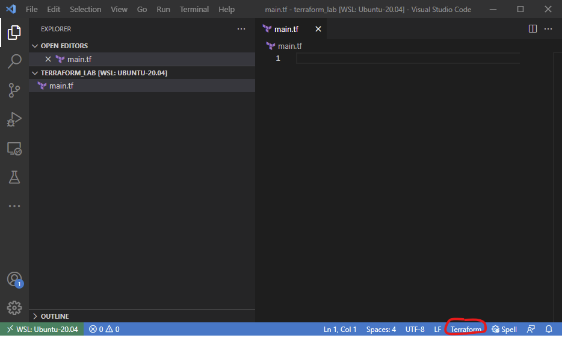
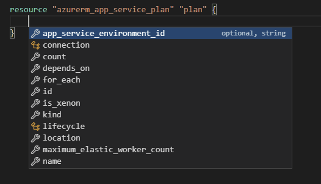
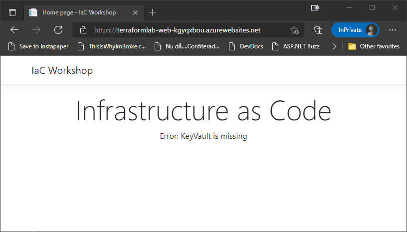
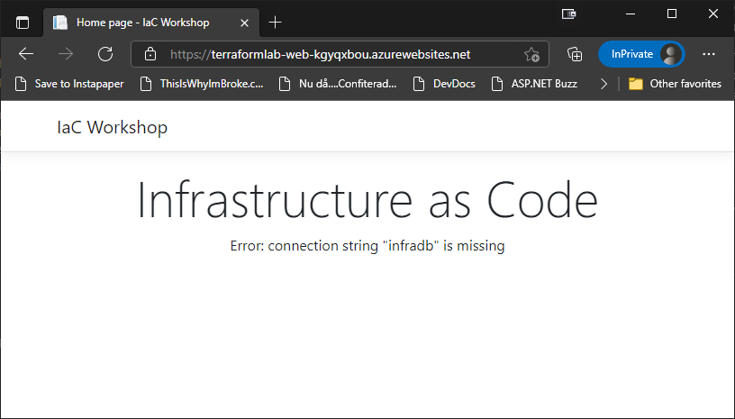
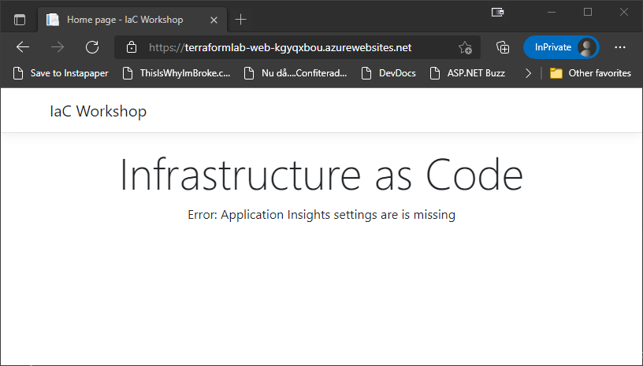
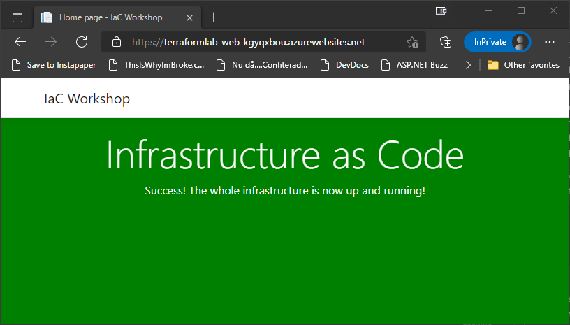

# Infrastructure as Code Labs - Terraform
Welcome to the Terraform lap for the Infrastructure as Code workshop. In this lab, you will setup of the following infrastructure resources in Azure using Terraform, and validate your deployed infrastructure using a pre-built web application along the way:

* Azure App Service running on Linux
* Azure Key Vault for storing sensitive information, such as passwords
* Azure SQL Server and a SQL database
* Application Insights resource backed by a Log Analytics workspace

## Prerequisites
To complete the lab you need to install the Terraform tooling which include

* Azure CLI
* Visual Studio Code 
* Terraform
* Optional: HashiCorp Terraform Visual Studio Extension

You can find the latest installation instructions for your environment here:

* Azure CLI - https://docs.microsoft.com/en-us/cli/azure/install-azure-cli
* Visual Studio Code - https://code.visualstudio.com/download
* Terraform - https://learn.hashicorp.com/tutorials/terraform/install-cli?n=terraform/azure-get-started

For Windows users it is recommended to use the package manager Chocolatey. The benefit of using this over manually installing the binary, is that you don't have to add the path to the binary to the `PATH` environment variable.

If you really don't want to use Chocolatey, don't forget to add the path to the Terraform binary to the `PATH` environment variable. Either in the command prompt you are using

```bash
> $env:Path += ";C:\Users\Download\Terraform\"  
```

or to the system's variable.

__Note:__ If you add it to the system's variable, you will have to restart the terminal

Once you have the tools installed, you can verify that the CLI parts are working by running:

```bash
> az version
{
  "azure-cli": "2.28.0",
  "azure-cli-core": "2.28.0",
  "azure-cli-telemetry": "1.0.6",
  "extensions": {}
}

> terraform version
Terraform v1.0.8
```

With the tools in place, you need to either log in to the Azure CLI, or, if you are already logged in, validate that you are using the correct subscription.

To log in, run the following command, and go through the login procedure

```bash
> az login
```

To validate that you are using the correct subscription, you can run

```bash
> az account show
{
  ...
  "id": "XXXXXXXX-XXXX-XXXX-XXXX-XXXXXXXXXXXX",
  ...
  "name": "My Subscription"
}
```

If this is not the required subscription, you can list the available subscriptions by running

```bash
> az account list -o table
```

and select the subscription you want by running

```bash
> az account set -s <SUBSCRIPTION ID>
```

## Setting up the project
Create a new folder for you Terraform project and open the folder in Visual Studio Code. In the folder, create a new file called *main.tf*, and open it in the editor. 

If you have installed the Terraform extension, you can look at the lower right corner to make sure that it is activated for the current file



## Setting up Terraform
Before you can start defining the infrastructure, you need to configure Terraform to support the creation of Azure resources. This is done by configuring a *provider*. In this case the `hashicorp/azurerm` provider.

To define a provider, you first add a `terraform` block, and inside that you define your required providers using the `required_providers` section.

__Note:__ Information about how to configure providers are available at https://www.terraform.io/docs/language/providers/requirements.html

In this case, you want to use version `~> 2.65` of the `hashicorp/azurerm` provider.

This should end up with a `terraform` block at the top of your file that looks like this

```
terraform {
  required_providers {
    azurerm = {
      source  = "hashicorp/azurerm"
      version = "~> 2.65"
    }
  }
}
```

The `azurerm` provider also needs a default configuration to be added. However, as you don't need any particular configuration for it, you just need to add a `provider` block called __azurerm__ with an empty `features` block inside it. Like this

```
provider "azurerm" {
  features {}
}
```

__Note:__ The `features` block is used to set generalized settings for certain resource types. However, in this lab, you will not be using any of these. But it sill needs an empty configuration to work.

In this lab, we will store the Terraform state locally, but it is definitely recommended to store it in some central location like the cloud for production scenarios. This is configured using a so called _backend_. More information about this can be found at: https://www.terraform.io/docs/language/settings/backends/index.html

Now that you have configured Terraform to use the `azurerm` provider, you can initialize Terraform in your local directory by running 

```bash
> terraform init
```

This will create a `.terraform` folder to store the binaries used during deployment etc, and a `.terraform.lock.hcl` file that is used to lock the versions of the dependencies being used.

## Azure App Service
To run a web application on Azure App Service, you need an app service plan and an app service. 

However, before you can create these resources, you need a Resource Group to put it in.

To create a Resource Group, you use a Terraform resource. Resources are defined using a syntax that looks like this

```
resource "<RESOURCE TYPE>" "<RESOURCE NAME>" {
  <PROPERTY NAME> = <PROPERTY VALUE>
}
```

For a Resource Group, the type is `azurerm_resource_group`. And for this lab, you can call it `rg`. Like this

```
resource "azurerm_resource_group" "rg" {
}
```

For this particular resource type, you need to configure the `name` and `location` properties. Choose a name that makes sense to you, and a location that is close to you. Something like this

```
resource "azurerm_resource_group" "rg" {
  name     = "TerraformLab"
  location = "westeurope"
}
```

__Note:__ Information about all the resources available in the Terraform Azure provider is available at: https://registry.terraform.io/providers/hashicorp/azurerm/latest/docs. This documentation contains everything you need to define your resources. Make good use of it during the lab! 

Now that you have a place to put your App Service Plan and App Service, you can turn your focus to defining these.

To create the app service plan, you need to create another resource. In this case an `azurerm_app_service_plan` resource called __plan__.

__Note:__ The name can be anything you want, but the lab will assume that the name is __plan__. If you choose another name, just remember to substitute it when the plan is referenced in future parts of the lab.

For this `azurerm_app_service_plan` resource, you need to set a few properties.

Luckily, if you have installed the Terraform extension, you should be able to get some help with this. Just put the caret inside the resource and press `Ctrl + Space`. This should bring up a list of the available properties.



The properties you should set are

* `name` - set to "terraformlab-plan"
* `location` - set to the same location as the resource group
* `resource_group_name` - set to the name of the resource group
* `kind` - set to "linux"
* `reserved` - set to true (required when using `kind = "linux"`)
* `sku` - set to an object with `tier` and `size` properties set to "Free" and "F1"

The `name` and `kind` properties are quite simple, as they are just strings. However, for the `location` and `resource_group_name` you can use a reference to the resource group resource instead of repeating the values.

To reference another resource's property you use the syntax `<RESOURCE TYPE>.<RESOURCE NAME>.<PROPERTY>`

When done, your resource should look like this:
```
resource "azurerm_app_service_plan" "plan" {
  name                = "terraformlab-plan"
  location = azurerm_resource_group.rg.location
  resource_group_name = azurerm_resource_group.rg.name
  kind                = "linux"
  reserved            = true

  sku {
    tier = "Free"
    size = "F1"
  }
}
```

For the Web App, you need a name that is unique. Because of this, when using IaC, you often add a (pseudo) random suffix to your names. This will make the likelihood of a naming collision much smaller. To do this in Terraform, you can use the `random_string` resource.

Go ahead and add a `random_string` resource called __suffix__, setting the following properties

* `length` - 8
* `special` - false

 This will generate an 6 character long random string using alphanumeric characters, that we can use as a suffix.

```
resource "random_string" "suffix" {
  length  = 8
  special = false
}
```
__Note:__ You can find out about the `random_string` resource at: https://registry.terraform.io/providers/hashicorp/random/latest/docs/resources/string

__Tip:__ If you find it hard getting the indentation correct, try pressing `Shift + Alt + F` to format your Terraform file. If you don't have the Terraform extension installed, you can also run the `terraform fmt` command. This will format all `.tf` tile in the current folder.

The `random_string` resource will generate a string that might contains both upper and lower case letters. This can cause problems in some resource names, as some resources only support lower case letters. To solve this, you can transform the "ID" to lower case using the `lower()` function, and store the resulting value in a "local".

__Note:__ There are quite a few function that you can use in Terraform. You can find all of them at: https://www.terraform.io/docs/language/functions/index.html

__Comment:__ Yes, it is possible to limit the `random_string` to only use lower case letters, but doing it this way makes it possible to also introduce functions and locals.

A "local" is basically a local variable that you can reference using the syntax `local.<LOCAL NAME>`. Locals are defined inside a `locals` block like this

```
locals {
    suffix = lower(random_string.suffix.id)
}
```

__Note:__ You can find out about the `random_string` resource at: https://registry.terraform.io/providers/hashicorp/azurerm/latest/docs/resources/app_service

Now that you have a random suffix to use for your resource names, you can go ahead and create the Web App. For this, you use the `azurerm_app_service` resource, setting the `name`, `location`, `resource_group_name` and `app_service_plan_id`. Once again, using references to the the other resources to set the values.

For the `name` property, you can use the string interpolation syntax `"name-${local.suffix}"` to suffix your chosen name with the random value.

```
resource "azurerm_app_service" "app" {
  name                = "terraformlab-web-${local.suffix}"
  location            = azurerm_app_service_plan.plan.location
  resource_group_name = azurerm_app_service_plan.plan.resource_group_name
  app_service_plan_id = azurerm_app_service_plan.plan.id
}
```

The `app_service_plan_id` defines what App Service Plan the app should be placed in.

There are a couple of more settings that need to be added to the `azurerm_app_service` resource.

First of all, you need to configure the app to use a Docker image called `iacworkshop.azurecr.io/infrawebapp:v1`. To do this, you need to add a `site_config` block, and set the `linux_fx_version` property to `DOCKER|iacworkshop.azurecr.io/infrawebapp:v1`

```
resource "azurerm_app_service" "app" {
  ...
  site_config {
    linux_fx_version = "DOCKER|iacworkshop.azurecr.io/infrawebapp:v1"
  }
}
```

This should make sure that the correct image is used for the application. However, as this is using a private Azure Container Registry repo you need to tell the web app to use that registry instead of Docker Hub. You also need to give it the credentials needed to access the private registry. Both of these tasks are completed by adding the following 3 app settings to the web app

* DOCKER_REGISTRY_SERVER_URL - "https://iacworkshop.azurecr.io"
* DOCKER_REGISTRY_SERVER_USERNAME - "iacworkshop"
* DOCKER_REGISTRY_SERVER_PASSWORD - Ask for this

To set the web app's app settings, you need to set the `app_settings` property to a string map with the keys and values you want to set. Like this
```
resource "azurerm_app_service" "app" {
  ...
  app_settings = {
    DOCKER_REGISTRY_SERVER_URL = "https://iacworkshop.azurecr.io"
    DOCKER_REGISTRY_SERVER_USERNAME = "iacworkshop"
    DOCKER_REGISTRY_SERVER_PASSWORD = "XXXXXXXXXXXX"
  }
}
```
Since you are configuring the App Service Plan to use the Free tier, you also need to turn off "Always On" and set the worker process to be 32-bit. This is done using the `always_on` and `use_32_bit_worker_process` properties in the `site_config` block.

```
resource "azurerm_app_service" "app" {
  ...
  site_config {
    ...
    always_on                 = false
    use_32_bit_worker_process = true
  }
}
```

That's almost it. The last step is to configure the app to use a "System Assigned Identity". This will allow the application to authenticate against Azure resources without having to have access to credentials. 

Configuring this is a matter of adding an `identity` block, and setting its `type` to `SystemAssigned`

```
resource "azurerm_app_service" "app" {
  ...
  identity {
    type = "SystemAssigned"
  }
}
```

__Note:__ You get help from the Terraform extension for most of these things. Unfortunately, string values like `SystemAssigned` is something you have to figure out yourself.

Ok, you should now have a template that looks like this

```
terraform {
  required_providers {
    azurerm = {
      source  = "hashicorp/azurerm"
      version = "~> 2.65"
    }
  }
}

provider "azurerm" {
  features {}
}

resource "azurerm_resource_group" "rg" {
  name     = "TerraformLab"
  location = "westeurope"
}

resource "azurerm_app_service_plan" "plan" {
  name                = "terraformlab-plan"
  location            = azurerm_resource_group.rg.location
  resource_group_name = azurerm_resource_group.rg.name
  kind                = "linux"
  reserved            = true

  sku {
    tier = "Free"
    size = "F1"
  }
}

resource "random_string" "suffix" {
  length  = 8
  special = false
}

locals {
  suffix = lower(random_string.suffix.id)
}

resource "azurerm_app_service" "app" {
  name                = "terraformlab-web-${local.suffix}"
  location            = azurerm_app_service_plan.plan.location
  resource_group_name = azurerm_app_service_plan.plan.resource_group_name
  app_service_plan_id = azurerm_app_service_plan.plan.id

  site_config {
    linux_fx_version          = "DOCKER|iacworkshop.azurecr.io/infrawebapp:v1"
    always_on                 = false
    use_32_bit_worker_process = true
  }

  app_settings = {
    DOCKER_REGISTRY_SERVER_URL      = "https://iacworkshop.azurecr.io"
    DOCKER_REGISTRY_SERVER_USERNAME = "iacworkshop"
    DOCKER_REGISTRY_SERVER_PASSWORD = "XXXXXXXXXXXX"
  }

  identity {
    type = "SystemAssigned"
  }
}
```

Now that the template is at a point where you can try and deploy it, there are a couple of things you can do. 

First of all, you can verify the template, and see what resources it will CRUD. You can do this by running

```bash
> terraform plan
```

This should give you a "ton" of information about what will happen when you deploy this to your Azure subscription. The important part being that it says

> Plan: 4 to add, 0 to change, 0 to destroy.

__Note:__ You can also output this plan to a separate file that you can use to do the actual deployment later on. In this lab, you will not use this step, and instead deploy it manually from the template.

After you have verified that Terraform wants to add 4 resources, you can deploy the infrastructure to Azure by running

```bash
> terraform apply
```

When doing this, it will run `plan` for you automatically, output the same information as `terraform plan`, and then ask you if you want to proceed. Enter "yes" to start the deployment.

__Note:__ You can add `-auto-approve` to the command to skip the verification step. This is required in a non-interactive scenario like a deployment pipeline.

The deployment should complete successfully, even if it might take a few minutes for it to deploy.

During the deployment, the current state will be added to a __terraform.tfstate__ file in the current folder.

__Note:__ The next time you run `terraform apply`, the contents of the state file will be added to a new file called __terraform.tfstate.backup__ which contains the state for previous deployments.

To test the web app, you need to find out what hostname was assigned to it. To find this, run 

```bash
> az webapp list -o table
```

Locate your web app and browse to the URL shown in the *DefaultHostName* column



__Note:__ It can take a couple of minutes for the web app to come online

However, before we go any further, there is a small clean up task to perform. As you might have notices, the resources follow a convention that looks like this `<PROJECT NAME>-<RESOURCE TYPE>-<SUFFIX>`. This convention might be a bit simplistic, but works fine for something as small as this demo. However, you are currently repeating the `<PROJECT NAME>` part for every resource. If would definitely be a much better solution to move this to a `local` just as you did with the `suffix` value. So, go ahead and add another `local` called __project_name__, and update the resource names to use this value instead. Like this

```
locals {
  ...
  project_name = "terraformlab"
}

resource "azurerm_app_service_plan" "plan" {
  name  = "${local.project_name}-plan"
  ...
}

resource "azurerm_app_service" "app" {
  name = "${local.project_name}-web-${local.suffix}"
  ...
}

```

Nice, this will remove a lot of repetition in the future, and make it a lot easier to update. Which brings us to the next step in the lab.

## Parameterize template

Instead of hard coding various values in the template, such as the project name and App Service Plan SKU, we can extract them into parameters that can be passed at deployment time. This allows us to for example deploy the same template into multiple environments (dev, test, prod) with different configuration in each environment.

In Terraform, input parameters are defined using `variable` blocks. These blocks define at a minimum a variable name and a type. Byt it can also contain more information such as description and default value for example.

The first value you should turn into a variable is the project name. Right now, that is hard-coded to __terraformlab__.

In Terraform, any `.tf` inside the current folder is considered part of the template. This makes it easy to break out things in separate files. So go ahead and create a __inputs.tf__ file to hold the input variables, 

__Comment:__ If you find that the __main.tf__ file is getting a bit long, and hard to read, you can always split this into multiple files as well. Terraform will read them all before figuring out what to do. However, depending on how you split the template, it can make it a bit harder to track dependencies.

Inside that file, you can add a string based variable called __project_name__ like this

```
variable "project_name" {
  type        = string
  description = "The name of the project"
}
```

As you can see, the type is set to string, and there is a description to make it easier to understand what it is all about.

__Note:__ For more information about Terraform variables, have a look at https://www.terraform.io/docs/language/values/variables.html

With this new variable in place, you can now update both the name of the resource group, and the local that is used to prefix the resource names, using the syntax `var.<VARIABLE NAME>`. The name of the resource group can keep the default casing, but for the local it is best to make it lower-case as some resource do not allow for upper-case characters. Like this

```
resource "azurerm_resource_group" "rg" {
  name     = var.project_name
  ...
}
...
locals {
  ...
  project_name = lower(var.project_name)
}
```

Next you can turn the App Service Plan tier and SKU into variables. Right now they are hard-coded to __Free__ and __F1__. Just open the __inputs.tf__ file and add two string based variables called __app_service_plan_tier__ and __app_service_plan_sku__. However, for these values you should add defaults that correspond to the current values. This makes sure that these values are used if no other values are provided during deployment. Like this

```
variable "app_service_plan_tier" {
  type        = string
  description = "App Service Plan Tier"
  default     = "Free"
}

variable "app_service_plan_sku" {
  type        = string
  description = "App Service Plan SKU"
  default     = "F1"
}
```

With these variables in place, you need to update the `azurerm_app_service_plan` resource, setting the tier and SKU size using the variables instead of the hard-coded values.

```
sku {
    tier = var.app_service_plan_tier
    size = var.app_service_plan_sku
}
```

You can also update the `always_on` and `use_32_bit_worker_process` properties of the `azurerm_app_service` resource now that you might not be using the free tier that forces you to set these to less than optimal values.

To set these values, you can use a conditional expression like this

```
resource "azurerm_app_service" "app" {
  ...
  site_config {
    ...
    always_on = lower(var.app_service_plan_tier) == "free" ? false : true
    use_32_bit_worker_process = lower(var.app_service_plan_tier) == "free" ? true : false
  }
}
```

This will make sure that the values are set to the optimal values based on the chosen tier.

A convenient way to pass many parameter values to a deployment is to create a separate parameter file. This is done using a `.tfvars` file that contains all parameters that you want to pass to the deployment, along with the values for them.

Add a new file called __terraform.tfvars__ to the same folder as the __main.tf__ file.

__Note:__ Calling it __terraform.tfvars__ is a convention that means that you do not have to manually add the `.tfvars` to the Terraform commands during deployment. Instead, Terraform will automatically pick up any file with this name.

To set the desired values in the `.tfvars` file, just add the following

```
project_name = "TerraformLab"
app_service_plan_tier = "Free"
app_service_plan_sku = "F1"
```

__Note:__ The extension will help you with this as well. Just press the trusty `Ctrl + Space` and the available variables show up

During deployment, you can then define the file manually by using the `-var-file="terraform.tfvars"`, or just depend on the naming convention.

You can also set the variables by using the `-var` parameter like this `terraform apply -var="project_name=TerraformLab"`. Or use a combination the two.

Verify that the deployment works by running

```bash
> terraform apply -var-file="terraform.tfvars"
```

The result of this should be an output that says

> Apply complete! Resources: 0 added, 0 changed, 0 destroyed.

as you didn't actually make any changes. You only refactored the code to be a bit easier to read and work with.

## Storing and accessing secrets with Azure KeyVault

Before you set up the SQL Server resources, you are going to create an Azure KeyVault to store sensitive information. In this case it will store a single one secret that will be used by the application.

Add an `azurerm_key_vault` resource called __kv__ to the __main.tf__ file and set the following properties

* `name` - "${local.project_name}-kv-${local.suffix}"
* `location` - same as the resource group
* `resource_group_name` - the name of the resource group
* `sku_name` - "standard"

It should look like this

```
resource "azurerm_key_vault" "kv" {
  name = "${local.project_name}-kv-${local.suffix}"
  location = azurerm_resource_group.rg.location
  resource_group_name = azurerm_resource_group.rg.name
  sku_name = "standard"
}
```

The KeyVault also needs the tenant id of the Azure AD tenant that should be used for access control. In this case, this should be the same tenant that the current user is coming from. To get hold of that, Terraform has a _data source_ type called `azurerm_client_config`. 

Data sources are Terraform entities used to retrieve information from somewhere for use in the template. In this case, the thing you want to retrieve is the current Azure client configuration, which is available through the `azurerm_client_config` type. 

Data sources are defined using the following syntax `data "<DATA SOURCE TYPE>" "<NAME>" {}`. It also supports properties like regular resources, but they are no necessary in all situations.

To get hold of the required information, you should create a data source that looks like this

```
data "azurerm_client_config" "current" {}
```

You should then set the `tenant_id` property of the `azurerm_key_vault` resource to the data source's `tenant_id`. To read values from the data source, you use the same "dot notation" as for other resources, but you need to prefix it with data, for example `data.azurerm_client_config.current.tenant_id`. In the end, you should en up with the following

```
resource "azurerm_key_vault" "kv" {
  name                = "${local.project_name}-kv-${local.suffix}"
  location            = azurerm_resource_group.rg.location
  resource_group_name = azurerm_resource_group.rg.name
  sku_name            = "standard"
  tenant_id           = data.azurerm_client_config.current.tenant_id
}
```

__Note:__ You can find out about the `azurerm_key_vault` resource at: https://registry.terraform.io/providers/hashicorp/azurerm/latest/docs/resources/key_vault

With the KeyVault in place, you can turn your focus towards adding the KeyVault secret that the application needs. 

To create a KeyVault secret, you need a new resource of the type `azurerm_key_vault_secret`. And you only need to set the following 3 properties 

* `name` - testSecret
* `value` - secretValue
* `key_vault_id` - the id of the __kv__ KeyVault

It should look something like this

```
resource "azurerm_key_vault_secret" "secret" {
  name         = "testSecret"
  value        = "secretValue"
  key_vault_id = azurerm_key_vault.kv.id
}
```

Now that you have the KeyVault and secret in place, you can try deploying the infrastructure again by running

```bash
> terraform apply
```

The result should be that it needs to add 2 resources, to which you can answer __yes__.

Unfortunately, this fails with the error

> Error: checking for presence of existing Secret "testSecret"...does not have secrets get permission on key vault...

__Note:__ Yes, this is abbreviated, but contains the most important parts.

This error message is telling you that the user responsible for running Terraform (you) do not have permission to read the secrets in the vault. A permission that is required when managing KeyVault secrets from Terraform.

To solve this, you need to add an access policy that allows the current user to access the KeyVault secrets.

To create an access policy, you need to add an `access_policy` child block to the KeyVault resource. The policy needs the tenant ID and the object ID of the identity that is to be affected by this policy. In this case, that's the user currently executing the script, which is available through the `azurerm_client_config` data source called __current__.

To configure the access policy, you need to set the following properties

* `tenant_id` - __azurerm_client_config.current__ resource's `tenant_id`
* `object_id` - __azurerm_client_config.current__ resource's `object_id`

__Note:__ Remember that the __azurerm_client_config.current__ is a data source, so to read its values, you need to prefix it with __data__

You also need to configure the access policy to give the identity _Get_, _List_, _Set_ and _Delete_ permissions for secrets. This is done by setting the `access_policy`'s `secret_permissions` property to a string array containing the "Get", "List", "Set", "Delete", "Purge" and "Recover" strings.

__Warning:__ "Purge" and "Recover", has to do with KeyVault using a "soft deleted" paradigm to make sure secrets are deleted by mistake. By adding these 2 permissions, Terraform can properly handle this. 

In the end, you should end up with something that looks like this

```
resource "azurerm_key_vault" "kv" {
  ...
  access_policy {
    tenant_id = data.azurerm_client_config.current.tenant_id
    object_id = data.azurerm_client_config.current.object_id

    secret_permissions = [
      "Get",
      "List",
      "Set",
      "Delete",
      "Purge",
      "Recover"
    ]
  }
}
```

This allows the current user to access the KeyVault, however, that is only useful during deployment. When the app is running, the access will be done by the web app's system assigned managed identity. Because of this, you also need to add an access policy that allows the web app to read the secrets in the KeyVault. This is done by adding a __second__ `access_policy` block to the KeyVault resource. In this case, the `tenant_id` and `object_id` should be set to the web app's system assigned managed identity, which is available as the first item in the `azurerm_app_service.app.identity` array. 

You should also limit the permissions to `Get` and `List` for secrets.

This means creating a block that looks like this

```
resource "azurerm_key_vault" "kv" {
  ...
  access_policy {
    tenant_id = azurerm_app_service.app.identity[0].tenant_id
    object_id = azurerm_app_service.app.identity[0].principal_id

    secret_permissions = [
      "Get",
      "List"
    ]
  }
}
```

With the KeyVault and the correct permissions in place, you need to tell the web app the name of the KeyVault so it knows where to look for it. For this, the app expects an app setting called __KeyVaultName__ to contain the name of the KeyVault. Unfortunately, the KeyVault resource already has a reference to the web app, so adding a reference from the web app to the KeyVault would cause a cyclic dependency. Because of this, you have to set the value "manually", using the same string as the KeyVault resource is using. Like this

```
resource "azurerm_app_service" "app" {
  ...
  app_settings = {
    ...
    KeyVaultName = "${local.project_name}-kv-${local.suffix}"
  }
  ...
}
```

__Note:__ A better solution might be to create a local so you don't end up with a change to one but not the other. But to keep it simple, you will handle it like this in this lab.

Now, you can try deploying the infrastructure again using

```bash
> terraform apply
```
Once that is done, you can try to refresh the web app in the browser to verify that it can successfully read the secret from the vault now.



## Add SQL storage

The web application uses SQL Server database for data storage, so you need to create an Azure SQL Server and an Azure SQL Database as part of you infrastructure.

A part of setting up the SQL Server is setting up an admin user. For this, you need to create a username and a password. For this you can use the `random_password` resource, which is specifically made for creating random passwords. All you need to do, is to create a new `random_password` resource called __sql_admin_password__, setting the following properties

* `length` - 16
* `special` - true

Like this

```
resource "random_password" "sql_admin_password" {
  length  = 16
  special = true
}
```

The actual password string is available through the `result` property.

__Note:__ You can find more information about the `random_password` at: https://registry.terraform.io/providers/hashicorp/random/latest/docs/resources/password 

With the password set up, you can carry on with the creation of the SQL Server instance. For this, you will need a new resource of the type `azurerm_mssql_server` called __sql_server__. The properties you need to set for this resource are

* name - "${local.project_name}-sql-${local.suffix}"
* location - the same location as the resource group resource
* resource_group_name - the same as the resource group resource
* version - "12.0"
* administrator_login - "infraadmin"
* administrator_login_password - the `result` property from the __sql_admin_password__ resource

Like this

```
resource "azurerm_mssql_server" "sql_server" {
  name                         = "${local.project_name}-sql-${local.suffix}"
  location                     = azurerm_resource_group.rg.location
  resource_group_name          = azurerm_resource_group.rg.name
  version                      = "12.0"
  administrator_login          = "infraadmin"
  administrator_login_password = random_password.sql_admin_password.result
}
```

__Note:__ You can find out about the `azurerm_mssql_server` resource at: https://registry.terraform.io/providers/hashicorp/azurerm/latest/docs/resources/mssql_server

The next step is to add the SQL Server database to the server. And as usual, that means adding another resource. In this case a `azurerm_mssql_database` called __db__. For the database resource, you need to set

* name - "infradb"
* server_id - the ID of the __sql_server__ resource
* collation - "SQL_Latin1_General_CP1_CI_AS"
* sku_name - "Basic"
* max_size_gb - 1

That's it! It should look like this

```
resource "azurerm_mssql_database" "db" {
  name        = "infradb"
  server_id   = azurerm_mssql_server.sql_server.id
  collation   = "SQL_Latin1_General_CP1_CI_AS"
  sku_name    = "Basic"
  max_size_gb = 1
}
```

Now you have the web app and the database defined, but you still need to make sure that the web app can talk to the database. This requires three things, a connection string for the web app to use, the necessary permissions for the the web app's assigned identity to access the database, and that the firewall to the SQL Server is opened to allow traffic to access it. Let's start with the connection string. 

To add a connection string setting to the web app, you need to add a `connection_string` block to the web app. The `connection_string` block should contain 3 properties that you need to set

* name - "infradb"
* type - "SQLAzure"
* value - "Data Source=tcp:${local.project_name}-sql-${local.suffix}.database.windows.net,1433;Initial Catalog=infradb;Authentication=Active Directory Interactive;"

Unfortunately, you cannot use references to the SQL Server and database resources when creating the connection string as this would cause a cyclic dependency chain when setting up the web app access. So you will just have to manually create the dynamic connection string values, like the host name of the server.

So the end result becomes this

```
resource "azurerm_app_service" "app" {
  ...
  connection_string {
    name = "infradb"
    type = "SQLAzure"
    value = "Data Source=tcp:${local.project_name}-sql-${local.suffix}.database.windows.net,1433;Initial Catalog=infradb;Authentication=Active Directory Interactive;"
  }
}
```

__Note:__ If you need more than one connection string, you can add multiple `connection_string` blocks to the `azurerm_app_service` resource

The second part is to give the web app's assigned identity access to the database. In this case, you will do this by making it the Active Directory admin of the Azure SQL Server.

__Warning:__ It is not recommended to make an app's managed identity the SQL Server admin as it will give full access to the entire server. However, for the sake of simplicity, this is what you will be doing in this lab. In a real world scenario you should create and use a less privileged SQL Server user for the identity.

To set the SQL Server's Azure AD administrator, you need to add a `azuread_administrator` block to the `azurerm_mssql_server` resource. The `azuread_administrator` contains only 2 properties that you need to set

* `login_username` - the SQL Server login name for the Azure AD administrator, in this case the name of the Web App
* `object_id` - the Azure AD object ID for the Azure AD account to use, in this case the `principal_id` of the first entry in the `azurerm_app_service.app.identity` list

It should look like this

```
resource "azurerm_mssql_server" "sql_server" {
  ...

  azuread_administrator {
    login_username = azurerm_app_service.app.name
    object_id = azurerm_app_service.app.identity[0].principal_id
  }
}
```

The last part to making this work, is to open the SQL Server firewall for incoming traffic. In this case, you will configure it to allow traffic from all Azure based IP addresses. For this, you need to create an `azurerm_mssql_firewall_rule` resource. The firewall rule requires you to set 4 properties in this case

* `name` - the name of the rule, in this case __AllowAllWindowsAzureIps__
* `server_id` - The ID of the SQL Server instance to add the rule to
* `start_ip_address` & `end_ip_address` - the IP address span to allow. In this case, both these should be set to `0.0.0.0`

Like this

```
resource "azurerm_mssql_firewall_rule" "allow_azure_ips" {
  name             = "AllowAllWindowsAzureIps"
  server_id        = azurerm_mssql_server.sql_server.id
  start_ip_address = "0.0.0.0"
  end_ip_address   = "0.0.0.0"
}
```

__Note:__ For more information about the `azurerm_mssql_firewall_rule` resource, have a look at: https://registry.terraform.io/providers/hashicorp/azurerm/latest/docs/resources/mssql_firewall_rule

Now, re-deploy the Terraform code again, and then refresh the web page. It should now be able to connect to the database.



## Add Application Insights

The last piece of this infrastructure puzzle, is the addition of the Application Insights monitoring of the web app. You will also make sure to use the later version of this feature, and set it up to store its data in a Log Analytics Workspace for further analysis.

The first step is to add the Log Analytics Workspace. And as usual, that requires you to add another resource to your infrastructure. In this case it's a `azurerm_log_analytics_workspace` resource called __laws__. 

As you will use the default settings for most of the available configuration for this resource, you only need to set the following properties

* name - "${local.project_name}-laws-${local.suffix}"
* location - the same location as the resource group
* resource_group_name - the name of the resource group

So, in the end, it turns out like this

```
resource "azurerm_log_analytics_workspace" "laws" {
  name                = "${local.project_name}-laws-${local.suffix}"
  location            = azurerm_resource_group.rg.location
  resource_group_name = azurerm_resource_group.rg.name
}
```

__Note:__ If you want to know what other configurations you can do to the workspace, have a look at: https://registry.terraform.io/providers/hashicorp/azurerm/latest/docs/resources/log_analytics_workspace

With the storage in place, you can go ahead and add a `azurerm_application_insights` resource, setting the following properties

* name - "${local.project_name}-ai-${local.suffix}"
* location - the same location as the resource group
* resource_group_name - the name of the resource group
* workspace_id - the ID of the __laws__ workspace resource
* application_type - "web"

Turning the declaration into this

```
resource "azurerm_application_insights" "ai" {
  name                = "${local.project_name}-ai-${local.suffix}"
  location            = azurerm_resource_group.rg.location
  resource_group_name = azurerm_resource_group.rg.name
  workspace_id        = azurerm_log_analytics_workspace.laws.id
  application_type    = "web"
}
```

__Note:__ The full spec for this resource is available at: https://registry.terraform.io/providers/hashicorp/azurerm/latest/docs/resources/application_insights

The final step in the addition of the Application Insights monitoring is to connect the web app to the Log Analytics resource. This is done by setting some "well-known" app settings for the web app. And these are 

* APPINSIGHTS_INSTRUMENTATIONKEY - set to the `instrumentation_key` property of the Application Insights resource
* APPLICATIONINSIGHTS_CONNECTION_STRING - set to the `connection_string` property of the Application Insights resource
* ApplicationInsightsAgent_EXTENSION_VERSION - should be `~3` for Linux-based servers, and `~2` for Windows-based ones
* XDT_MicrosoftApplicationInsights_Mode - should be `recommended` for recommended settings

Like this

```
resource "azurerm_app_service" "app" {
  ...
  app_settings = {
    ...
    APPINSIGHTS_INSTRUMENTATIONKEY = azurerm_application_insights.ai.instrumentation_key
    APPLICATIONINSIGHTS_CONNECTION_STRING = azurerm_application_insights.ai.connection_string
    ApplicationInsightsAgent_EXTENSION_VERSION = "~3"
    XDT_MicrosoftApplicationInsights_Mode = "recommended"
  }
}
```

You can now re-deploy the infrastructure and refresh the web page. It should now show you that your entire infrastructure is configured correctly.



## Add output variable

At the beginning of this lab, you went looking for the name of the web app using the `az webapp list` command. This is not very convenient, not to mention the fact that you'll often need this information later on in your deployment pipeline as well. For example when running smoke tests against a newly deployed web application.

The solution to this, is to find a way to programmatically convey this information from your code. And in Terraform, that is made possible by using output values. These define the pieces of information that you want to make available outside the deployment after it has run. In this case the address to the web app.

To define an output value, you use the `output` keyword, a name for the output value, so you can retrieve it, and a value. It is all defined as a single block like this

```
output "<OUTPUT NAME>" {
  value = <THE VALUE>
}
```

In this case, you want to output the address to the web app. This is sort of available through the `default_site_hostname` property of the `azurerm_app_service` resource. However, that contains only the host name. If you want to output the URL, you will need to do some string manipulation like this

```
output "website_address" {
  value = "https://${azurerm_app_service.app.default_site_hostname}/"
}
```

You can then re-deploy the infrastructure to get the newly added output value to be added to the Terraform state.

Once you have re-deployed the infrastructure, you can get the value of the output value by running

```bash
> terraform output website_address

"https://terraformlab-web-XXXXXXX.azurewebsites.net/"
```

or, if you want to get rid of the double quotes around it (which is often useful when using it programmatically)

```bash
> terraform output -raw website_address

https://terraformlab-web-XXXXXXX.azurewebsites.net/
```

__Note:__ There are a couple of more settings you can add to your outputs, such as whether or not it is `sensitive`. You can find out all about that at: https://www.terraform.io/docs/language/values/outputs.html

## Removing the infrastructure

Once you are done with the infrastructure you hae set up, you can tear it all down by simply executing

```bash
> terraform destroy
```

and confirming the removal of the resource by entering __yes__ and pressing enter when asked.

__Note__: Do not skip this step if you wish to do the Lab Extension bellow.

## Lab Extension - Modularizing the resources

At this point, the infrastructure is pretty much done. However, it seems likely that you might be creating more web apps in this infrastructure. And with the current way of defining resources, this could potentially end up with a lot of duplicated code. The solution to this is to use modules. 

A module is basically a group of resources bundled together, allowing you to re-use it without code duplication. Practically, local modules are just sub-folders in which you can place the same things you can put in the root folder. They can include everything you have seen so far, input parameters, resources, outputs etc. And by using inputs, you can configure the module just as you would configure your template. In this case, you will combine the web app and Application insights resources into a module. 

The first step in the process of creating this module, is to create a sub-folder called __web-app__. Inside this folder, you should create a new file called __main.tf__. 

Once you have the module folder, and the __main.tf__ file, you can go ahead and move the `azurerm_app_service` and `azurerm_application_insights` resources into the new file.

This causes some problems, as the resources are referring to other resources that are not available inside the module. To solve this, you use input parameters, just as you did in the root module. So go ahead and create an __inputs.tf__ file inside the __web-app__ folder.

For this module, you are going to have to create 9 inputs

* `web_name` - string
* `ai_name` - string
* `location` - string
* `resource_group_name` - string
* `app_service_plan_id` - string
* `app_service_plan_tier` - string
* `key_vault_name` - string
* `sql_server_domain_name` - string
* `db_name` - string
* `log_analytics_workspace_id` - string

```
variable "web_name" {
  type = string
}

variable "ai_name" {
  type = string
}

variable "location" {
  type = string
}

variable "resource_group_name" {
  type = string
}

variable "app_service_plan_id" {
  type = string
}

variable "app_service_plan_tier" {
  type = string
}

variable "key_vault_name" {
  type = string
}

variable "sql_server_domain_name" {
  type = string
}

variable "db_name" {
  type = string
}

variable "log_analytics_workspace_id" {
  type = string
}

```
__Note:__ You can also use a couple of `object` parameters instead, which would allow you to group the values together. If you are interested in trying this, have a look at: https://www.terraform.io/docs/language/expressions/types.html

With the inputs in place, you can update the `azurerm_app_service` and `azurerm_application_insights` resources by replacing all referenced values that are not available, with the input values using the `var.<INPUT NAME>` syntax. You also need to replace the names of the resources with the `web_name` and `ai_name` inputs.

Now that you have broken out these resources into their own module, you will need to reference that module from the root module. This is done using the following syntax

```
module "<MODULE NAME>" {
  source = "<PATH TO MODULE DIRECTORY>"
  <INPUT VALUES>
}
```

So in this case, you need to add the following to your root main.tf file

```
module "web" {
  source = "./web-app"
  web_name = "${var.project_name}-web-${local.suffix}"
  ai_name = "${var.project_name}-ai-${local.suffix}"
  location = azurerm_app_service_plan.plan.location
  resource_group_name = azurerm_app_service_plan.plan.resource_group_name
  app_service_plan_id = azurerm_app_service_plan.plan.id
  app_service_plan_tier = var.app_service_plan_tier
  key_vault_name = "${local.project_name}-kv-${local.suffix}"
  sql_server_domain_name = "${local.project_name}-sql-${local.suffix}"
  db_name = "infradb"
  log_analytics_workspace_id = azurerm_log_analytics_workspace.laws.id
}
```

__Note:__ Once again you cannot use a reference to the SQL Server or KeyVault, as it would cause a cyclic dependencies. Instead, you will have to concatenate the values "manually".

__Comment:__ In this case, it might be a better idea to use a couple of `locals` for the names, instead of hard coding them and having duplicate code. However, for simplicity, this lab uses duplicated strings.

There are still 3 outstanding issues that you need to fix though. The first two are related to the fact that the web app resource is now in the module, causing issues when setting the SQL Server AD Admin account, and when KeyVault access policy for the web app identity. To solve this, you need to add an output from the module for the web app's identity, and one for the web apps name in the web-app/main.tf file. Like this

```
output "web_app_name" {
  value = azurerm_app_service.app.name
}

output "web_app_identity" {
  value = azurerm_app_service.app.identity[0]
}
```

and then update the SQL Server AD Admin assignment and KeyVault access policy to use that output value instead.

The syntax for getting the value of an output from a module is `module.<MODULE NAME>.<OUTPUT NAME>`. So in this case you end up with

```
...
resource "azurerm_key_vault" "kv" {
  ...
  access_policy {
    tenant_id = module.web.web_app_identity.tenant_id
    object_id = module.web.web_app_identity.principal_id
  }
}
...
resource "azurerm_mssql_server" "sql_server" {
  ...
  azuread_administrator {
    login_username = module.web.web_app_name
    object_id      = module.web.web_app_identity.principal_id
  }
}
```

The last issue is the output `website_address` pointing to a resource that does not exist. To solve this, you first need to move the existing output to the `web-app` module's __main.tf__ file, where the web app resource is now located. And then you need to create a new output for the website address in the root __main.tf__ file, outputting the `website_address` from the module. 

```
output "website_address" {
  value = module.web.website_address
}
```

However, before you can redeploy the infrastructure, you do need to run `terraform init`. Otherwise Terraform won't know that there is a module that you can use.

Once Terraform has been re-initialized, you should be able to re-deploy the infrastructure. Terraform will decide that there are a couple of resources that need to be destroyed, and a couple that need to be created. The reason for this is that Terraform sees the resources inside the module as new resources, and the once that were previously in the root are now gone, so they need to be deleted.

__Note:__ If you didn't remove all the "old" resource before taking on this modularization, the names of the "new" resources will likely collide with the old ones. This might cause Terraform to fail to deploy everything at the first attempt. However, running it a second time should solve the problem.

Also, don't forget to remove your resources when you are done!

```bash
> terraform destroy
```
